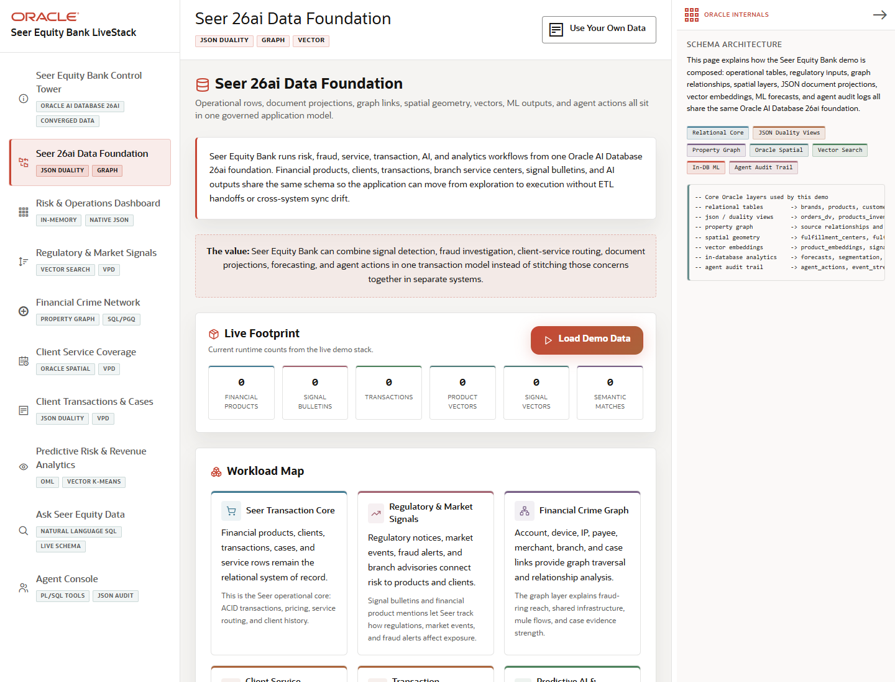

# Scene 1: Seer 26ai Data Foundation

## Introduction

This scene orients the user to the data foundation behind the finance LiveStack. Seer Equity Bank keeps products, clients, transactions, signal bulletins, service coverage, fraud relationships, vectors, ML features, and agent audit events in one Oracle-backed model.

Estimated Time: 10 minutes

### Objectives

In this lab, you will:
- Open the data model scene.
- Review the capability groups and live footprint counters.
- Use the restore-demo workflow as the baseline data reset pattern.

## Task 1: Open the data foundation

1. Open the left navigation.
2. Click **Seer 26ai Data Foundation**.
3. Review the capability cards for transaction core, signals, financial crime graph, client service coverage, transaction documents, and predictive AI.

Expected result:
- The page explains how the finance data product is organized.
- The user can connect each later demo scene to a data domain in the foundation.

## Task 2: Inspect live data readiness

1. Review the status cards for financial products, signal bulletins, transactions, product vectors, signal vectors, and semantic matches.
2. If the full stack is running and data is missing, click the demo restore action on this page.
3. Watch the progress message until the restore finishes and counts refresh.

Expected result:
- A healthy stack shows non-zero finance data counts after the restore flow.
- The user understands that vector artifacts and semantic matches are rebuilt as part of the dataset workflow.

## Task 3: Why this matters?

Finance demos often fail when each analytic or AI workflow depends on a different data copy. This scene establishes the opposite pattern: one governed Oracle data foundation feeds operations, risk, graph, spatial, vector, OML, and agent workflows.

## Credits & Build Notes
- **Author** - LiveLabs Team
- **Last Updated By/Date** - LiveLabs Team, 2026-05-13
