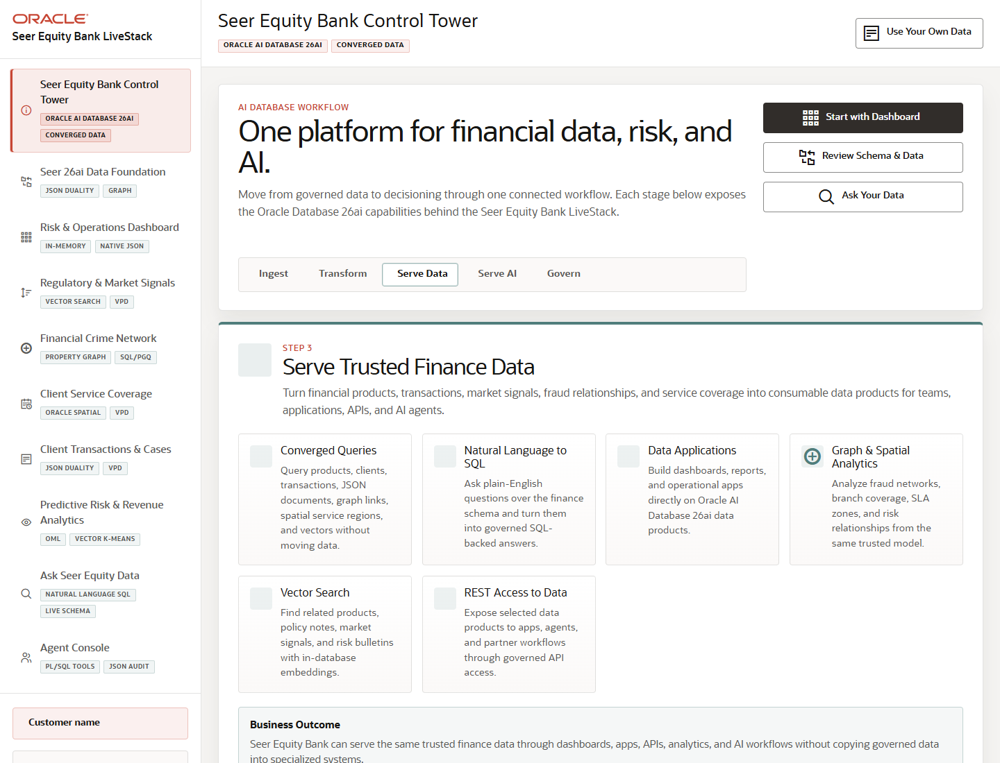

# Scene 10: Use Your Own Data

## Introduction

This operator workflow shows how to load a customer-specific finance dataset or restore the bundled Seer demo data. The dataset manager validates archive structure before executing any replacement.

Estimated Time: 8 minutes

### Objectives

In this lab, you will:
- Open the dataset manager from the top action bar.
- Download the template ZIP.
- Validate or restore data safely.

## Task 1: Open the dataset manager

1. From any scene, click **Use Your Own Data** in the top bar.
2. Review the overlay for the active dataset.
3. Choose whether to download a template, select a completed ZIP, validate it, upload it, or restore the Seer demo data.

Expected result:
- The dataset manager opens as an overlay without losing the current application context.
- The user sees a safe path for replacing demo data with customer-specific data.

## Task 2: Validate before replacement

1. Click **Download Template ZIP** to inspect the required CSV layout.
2. Select a completed ZIP when available.
3. Click **Validate** before executing upload or restore actions.
4. If you want to return to the seeded story, use **Restore Seer Demo Data**.

Expected result:
- Validation reports missing files, header issues, foreign key problems, warnings, or a clean dry run before destructive data replacement.
- Restoring the demo data rebuilds derived artifacts such as spatial zones, vectors, semantic matches, and fallback demand data.

## Task 3: Why this matters?

Field teams need a repeatable way to move from a packaged demo to a customer's own business language and data. The dataset manager makes that transition controlled: validate first, run second, and keep the finance app aligned with the Oracle schema contract.

## Credits & Build Notes
- **Author** - LiveLabs Team
- **Last Updated By/Date** - LiveLabs Team, 2026-05-13
