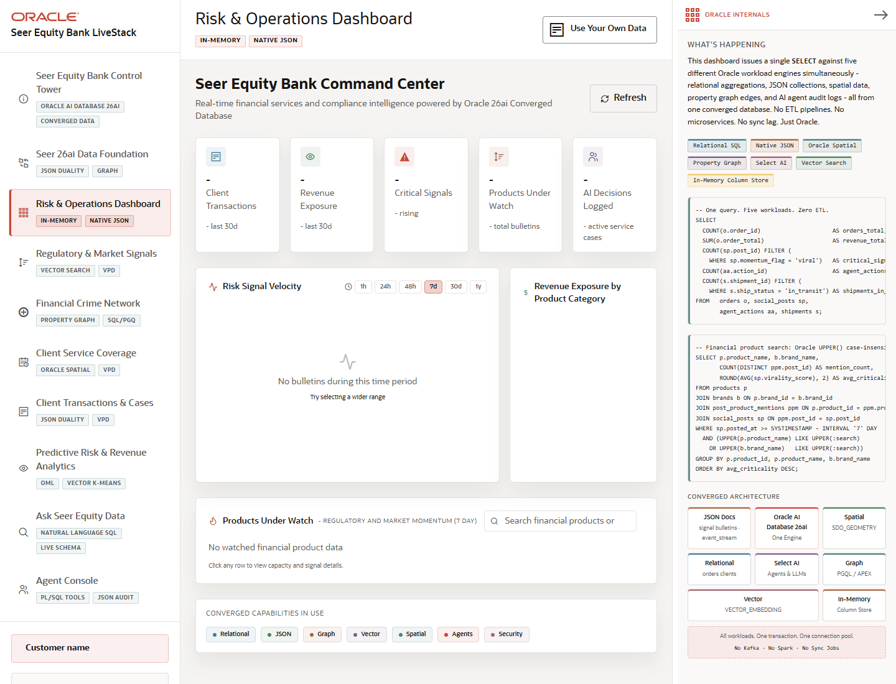

# Scene 2: Risk & Operations Dashboard

## Introduction

This scene is the executive control tower for Seer Equity Bank. It summarizes transaction activity, revenue exposure, critical signals, products under watch, and logged AI decisions in one dashboard.

Estimated Time: 10 minutes

### Objectives

In this lab, you will:
- Open the command center.
- Review the top operational metrics.
- Inspect how Oracle converged data capabilities support the dashboard.

## Task 1: Read the command center

1. Click **Risk & Operations Dashboard** in the left navigation.
2. Review the KPI cards for client transactions, revenue exposure, critical signals, products under watch, and AI decisions logged.
3. Use the financial product search box to search for a product, institution, or risk term.

Expected result:
- The dashboard narrows the operator's attention to the most important finance risks and opportunities.
- Search and filters help the user find product or institution context without leaving the workflow.

## Task 2: Inspect Oracle Internals

1. Open the **Oracle Internals** panel on the right.
2. Review the badges for relational SQL, native JSON, Oracle Spatial, property graph, Select AI, vector search, and In-Memory Column Store.
3. Compare those capabilities to the dashboard signals on screen.

Expected result:
- The dashboard is not a static report. It is a live app reading from Oracle-backed APIs and finance semantic layers.
- The user can explain how many data types appear together in a single business workflow.

## Task 3: Why this matters?

The dashboard gives executives and operators one place to see finance risk and revenue exposure. Oracle AI Database 26ai keeps the data close to the controls that use it, reducing movement, latency, and reconciliation work.

## Credits & Build Notes
- **Author** - LiveLabs Team
- **Last Updated By/Date** - LiveLabs Team, 2026-05-13
