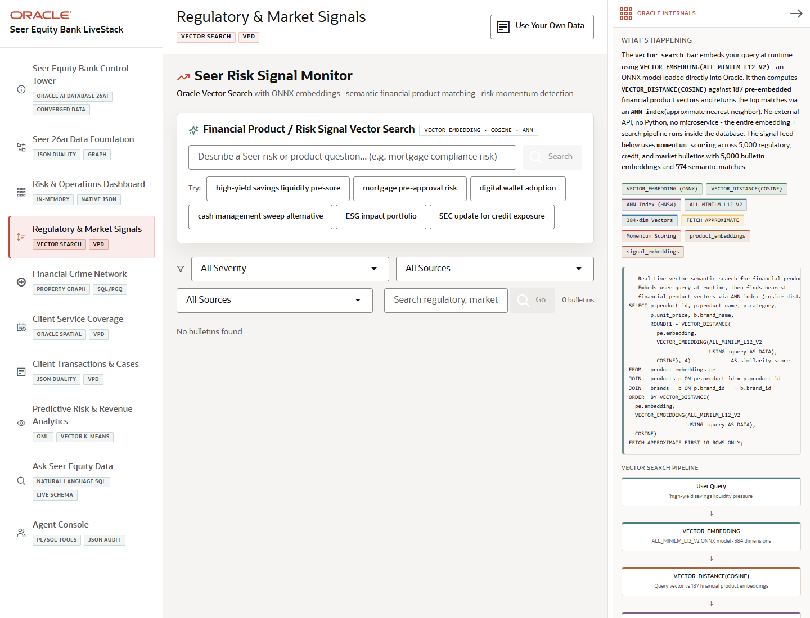

# Scene 3: Regulatory & Market Signals

## Introduction

This scene lets a risk or product team search regulatory, market, and fraud signals by meaning, not only keywords. The app embeds the user's query, compares it to stored finance vectors, and returns related products and bulletins.

Estimated Time: 10 minutes

### Objectives

In this lab, you will:
- Run a vector search over finance signals.
- Filter the signal feed by severity, source, and search text.
- Explain how in-database embeddings help connect unstructured signals to governed product data.

## Task 1: Run semantic search

1. Click **Regulatory & Market Signals**.
2. In **Financial Product / Risk Signal Vector Search**, enter a phrase such as `mortgage compliance risk`.
3. Click **Search**.
4. Review the matched financial products, similarity evidence, and related signals.

Expected result:
- The app returns finance matches based on semantic similarity.
- The user can see how a plain risk phrase maps to products, institutions, and exposure.

## Task 2: Review the signal feed

1. Use the feed filters for severity, source, influencer/source, or text search.
2. Click **Go** if using the feed search field.
3. Review the criticality, cases, and momentum indicators on the returned bulletins.

Expected result:
- The signal feed narrows to the risk slice the operator selected.
- The story connects regulatory or market language to measurable finance exposure.

## Task 3: Why this matters?

Financial institutions receive signals in messy language: notices, market events, branch alerts, fraud bulletins, and customer activity. Vector search in Oracle lets teams find relevant products and risks without copying sensitive data into a separate search platform.

## Credits & Build Notes
- **Author** - LiveLabs Team
- **Last Updated By/Date** - LiveLabs Team, 2026-05-13
