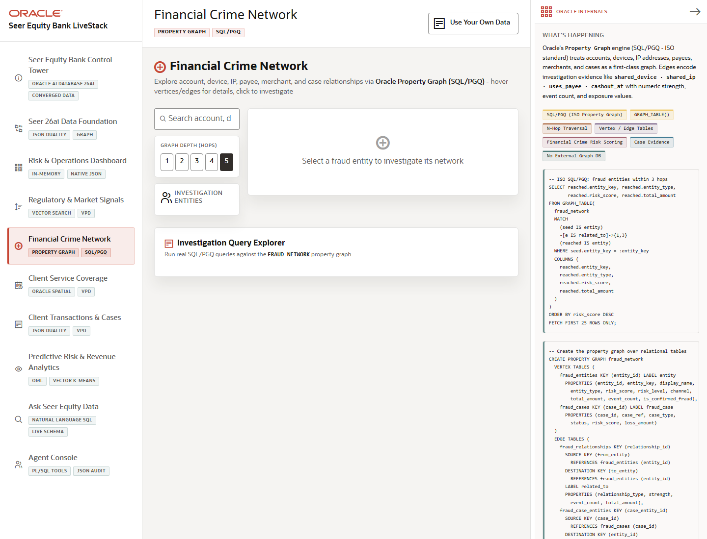

# Scene 4: Financial Crime Network

## Introduction

This scene demonstrates graph investigation for fraud and financial crime. Investigators can search accounts, devices, payees, IPs, merchants, branches, and cases, then expand relationships to see connected risk.

Estimated Time: 10 minutes

### Objectives

In this lab, you will:
- Open the graph investigation page.
- Search or select an investigation target.
- Run a graph query and inspect connected evidence.

## Task 1: Start an investigation

1. Click **Financial Crime Network**.
2. Search for an account, device, payee, case, or merchant in the graph search field.
3. Select a depth value from the graph depth controls.
4. Click **Investigate Financial Crime Network** or run one of the query cards.

Expected result:
- The scene displays connected entities and relationships for the selected target.
- Edges and node types show evidence such as shared device, shared IP, transfer, payee, merchant, or branch origin.

## Task 2: Inspect graph evidence

1. Hover over graph relationships to inspect strength, events, and exposure.
2. Click a node to open available detail.
3. Use **Show SQL** when available to reveal the graph query pattern.

Expected result:
- The user can explain why a case, account, or device is suspicious based on connected evidence.
- Oracle graph features are visible as part of the same finance application, not as a separate investigation tool.

## Task 3: Why this matters?

Fraud investigation is relationship work. Oracle property graph support lets Seer Equity Bank traverse suspicious networks close to the governed transaction and case data, improving explainability and reducing tool sprawl.

## Credits & Build Notes
- **Author** - LiveLabs Team
- **Last Updated By/Date** - LiveLabs Team, 2026-05-13
