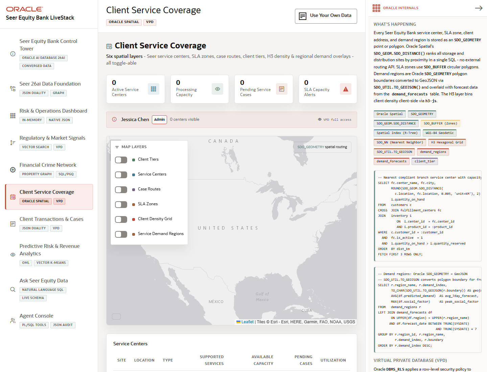

# Scene 5: Client Service Coverage

## Introduction

This scene shows how Seer Equity Bank uses Oracle Spatial to understand branch and service-center coverage, SLA zones, processing capacity, pending cases, and regional demand.

Estimated Time: 10 minutes

### Objectives

In this lab, you will:
- Open the service coverage map.
- Review service center, capacity, case, and alert metrics.
- Inspect map layers and spatial overlays.

## Task 1: Review service coverage

1. Click **Client Service Coverage**.
2. Review the cards for active service centers, processing capacity, pending service cases, and SLA capacity alerts.
3. Inspect the map and service center list.

Expected result:
- The page shows where service capacity exists and where demand or SLA pressure may require action.
- Operators can identify coverage gaps without leaving the finance workflow.

## Task 2: Compare spatial layers

1. Select available map layers such as centers, SLA zones, client density, or service demand regions.
2. Review how the map changes as each layer is enabled.
3. Open **Oracle Internals** and inspect the Spatial, R-Tree, H3, GeoJSON, and VPD badges.

Expected result:
- The map uses Oracle Spatial geometry and service overlays to explain operational coverage.
- The user can connect location intelligence to service-level and compliance decisions.

## Task 3: Why this matters?

Client experience risk is often geographic. Oracle Spatial lets Seer Equity Bank join service centers, SLA zones, client locations, demand regions, and security policies in one governed database workflow.

## Credits & Build Notes
- **Author** - LiveLabs Team
- **Last Updated By/Date** - LiveLabs Team, 2026-05-13
