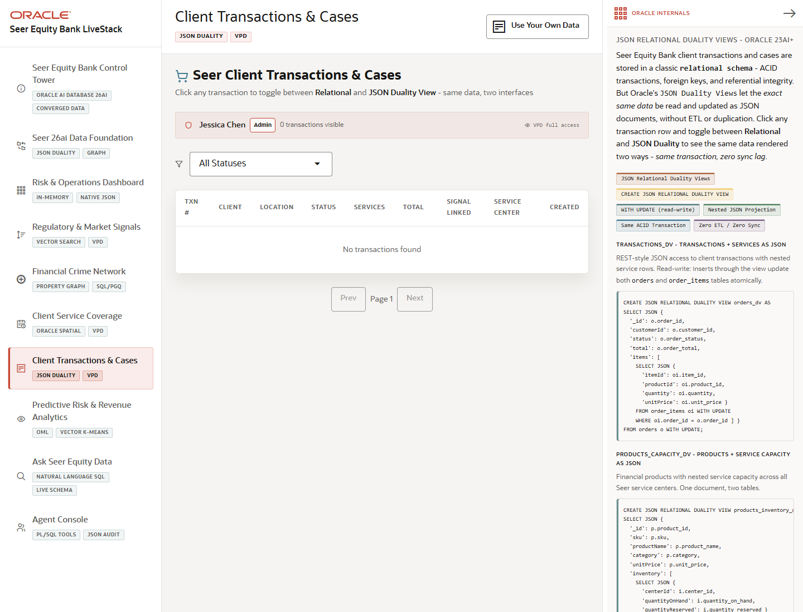

# Scene 6: Client Transactions & Cases

## Introduction

This scene shows operational transaction data as both relational rows and JSON duality documents. Users can inspect transaction records, status, service route information, and document projections without maintaining a separate document database.

Estimated Time: 10 minutes

### Objectives

In this lab, you will:
- Open the client transactions scene.
- Filter and inspect transaction records.
- Compare relational, JSON, and route views in the detail panel.

## Task 1: Inspect transactions

1. Click **Client Transactions & Cases**.
2. Use the status selector or pagination controls to narrow the table.
3. Open a transaction detail row.

Expected result:
- The transaction table shows finance cases and client activity with current status and value context.
- The detail panel opens for the selected transaction.

## Task 2: Compare detail views

1. In the detail panel, select the **Relational**, **JSON**, and **Route** views.
2. In the JSON view, click **Copy** if you want to inspect the document payload.
3. In the route view, toggle between route display options when available.

Expected result:
- The same business transaction can be inspected as normalized rows, nested JSON, and route evidence.
- JSON duality helps app teams serve document-shaped APIs while Oracle remains the ACID source of truth.

## Task 3: Why this matters?

Finance application teams need document-friendly APIs, but regulated transaction data still needs relational integrity. JSON Relational Duality gives Seer Equity Bank both patterns over the same governed data.

## Credits & Build Notes
- **Author** - LiveLabs Team
- **Last Updated By/Date** - LiveLabs Team, 2026-05-13
