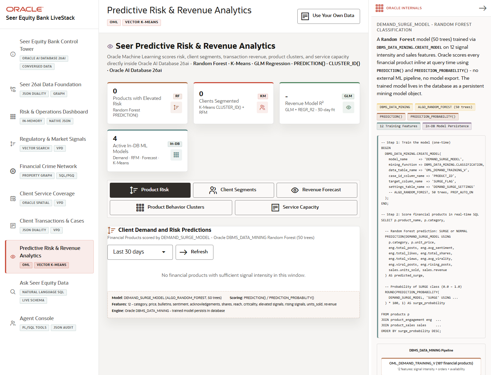

# Scene 7: Predictive Risk & Revenue Analytics

## Introduction

This scene demonstrates Oracle Machine Learning and SQL analytics inside the finance workflow. It includes product risk, client segmentation, revenue forecasting, product behavior clusters, and service capacity intelligence.

Estimated Time: 12 minutes

### Objectives

In this lab, you will:
- Open the predictive analytics scene.
- Review each analytics tab.
- Explain how Oracle scores and forecasts against governed finance data.

## Task 1: Review OML tabs

1. Click **Predictive Risk & Revenue Analytics**.
2. Select **Product Risk**, **Client Segments**, **Revenue Forecast**, **Product Behavior Clusters**, and **Service Capacity**.
3. Click **Refresh** on the tabs that provide a refresh action.

Expected result:
- Each tab presents a different analytic lens on the same finance data product.
- The user can compare classification, clustering, regression, forecasting, and capacity scoring patterns.

## Task 2: Inspect model evidence

1. Open **Oracle Internals**.
2. Review the active tab's model badges and SQL examples.
3. Compare the model output to the on-screen business decision, such as elevated product risk or revenue at risk.

Expected result:
- The app shows how Oracle ML models and SQL functions produce explainable finance signals.
- The user can tell which model or function supports each analytic view.

## Task 3: Why this matters?

Predictive analytics is more useful when it stays close to live finance data. Oracle Machine Learning lets Seer Equity Bank score risk, segment clients, forecast revenue, and assess capacity without exporting governed data to disconnected ML pipelines.

## Credits & Build Notes
- **Author** - LiveLabs Team
- **Last Updated By/Date** - LiveLabs Team, 2026-05-13
