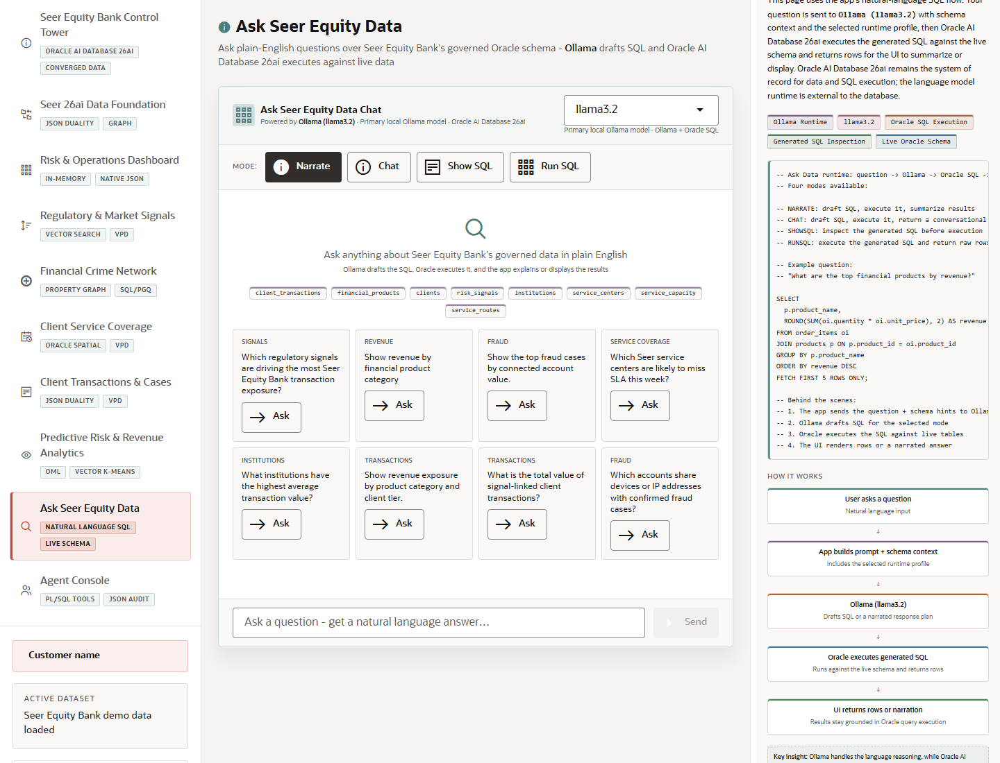

# Scene 8: Ask Seer Equity Data

## Introduction

This scene lets users ask plain-English questions over the governed finance schema. Ollama drafts SQL or narrative plans, while Oracle executes the generated SQL against live data and returns grounded results.

Estimated Time: 10 minutes

### Objectives

In this lab, you will:
- Ask a natural-language question.
- Switch response modes.
- Inspect generated SQL and returned rows where available.

## Task 1: Ask a finance question

1. Click **Ask Seer Equity Data**.
2. Select a mode such as **Narrate**, **Chat**, **Show SQL**, or **Run SQL**.
3. Click an example question or type a question such as `Show the top fraud cases by connected account value`.
4. Click **Send**.

Expected result:
- The page returns a narrated answer, generated SQL, rows, or a conversational response based on the selected mode.
- The response remains grounded in Oracle schema context and live query execution.

## Task 2: Compare modes

1. Ask the same question in **Show SQL** mode.
2. Switch to **Run SQL** mode and send the question again.
3. Review the table or result explanation that appears.

Expected result:
- The user sees the difference between SQL inspection and SQL execution.
- The scene makes it clear that the LLM assists with interpretation while Oracle remains the query engine.

## Task 3: Why this matters?

Business users want answers without waiting for every report to be built by hand. This scene shows a governed path: natural language helps create the question, and Oracle executes against trusted finance data.

## Credits & Build Notes
- **Author** - LiveLabs Team
- **Last Updated By/Date** - LiveLabs Team, 2026-05-13
