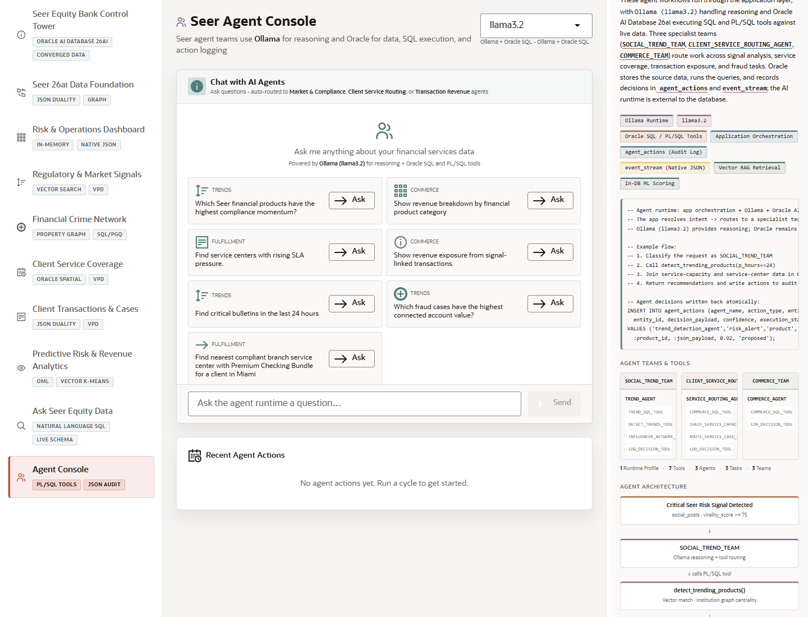

# Scene 9: Agent Console

## Introduction

This scene demonstrates routed AI agent workflows. Questions are assigned to specialist finance teams for market and compliance signals, client service routing, transaction exposure, and fraud tasks.

Estimated Time: 10 minutes

### Objectives

In this lab, you will:
- Ask an agent-runtime question.
- Review routed team behavior.
- Inspect recent agent actions and Oracle audit evidence.

## Task 1: Ask an agent

1. Click **Agent Console**.
2. Choose a runtime profile if more than one is available.
3. Click an example question such as **Show revenue exposure from signal-linked transactions.**
4. Click **Ask** or type your own question and click **Send**.

Expected result:
- The agent console routes the question to the appropriate specialist team.
- The response includes finance reasoning, tool use, SQL-backed results, or follow-up evidence.

## Task 2: Review actions and internals

1. Review **Recent Agent Actions** after the response finishes.
2. Open **Oracle Internals**.
3. Inspect the badges for Ollama runtime, Oracle SQL and PL/SQL tools, `agent_actions`, `event_stream`, vector retrieval, and in-database ML scoring.

Expected result:
- The user sees both the AI answer and the durable action trail.
- Oracle remains the system of record for tool execution, SQL, PL/SQL, and audit logging.

## Task 3: Why this matters?

Agent workflows need more than a chat box. They need governed data access, tool execution, durable decisions, and auditability. This scene shows how Oracle-backed agents can support finance operations without losing control of sensitive data.

## Credits & Build Notes
- **Author** - LiveLabs Team
- **Last Updated By/Date** - LiveLabs Team, 2026-05-13
