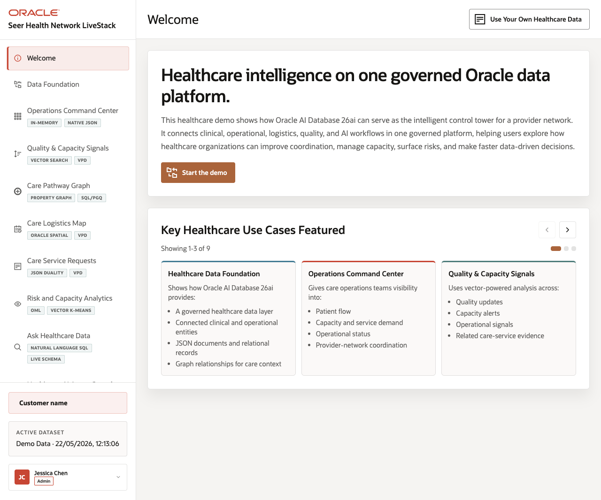

# Seer Health Network Healthcare LiveStack Guide

## Introduction

Healthcare organizations need to coordinate patient flow, provider capacity, care logistics, quality signals, service requests, analytics, and AI-assisted decisions while keeping operational data governed. Those workflows often live in separate applications, data marts, document stores, search systems, mapping tools, notebooks, and AI experiments. The result is a slower operating model: users can see part of the picture, but they cannot easily trace a decision back to the same trusted healthcare data foundation.

This runbook supports the Seer Health Network Healthcare LiveStack Demo. The demo shows how Oracle AI Database 26ai can bring healthcare operations workloads together on one connected data platform. Instead of splitting relational transactions, JSON documents, graph relationships, spatial analysis, vector search, in-database machine learning, natural-language SQL, and AI agent workflows across different systems, the LiveStack shows how those capabilities can work against the same governed Oracle data model.

In the demo, Seer Health Network uses Oracle AI Database to connect care services, care sites, service requests, quality and capacity bulletins, patient pathway relationships, logistics geography, predictive analytics, conversational data access, and agent-assisted operations. Each scene is designed to help you explain a practical healthcare operations challenge and then show how a converged Oracle database capability supports a clearer decision path.

Estimated Demo Time: 90 minutes

Each scene is designed to take between 5 and 10 minutes.

### Objectives

In this LiveStack Demo, you will:
- Explore the key healthcare use cases featured in the Seer Health Network demo, from the data foundation and command center to quality signals, care pathways, logistics, service requests, analytics, conversational data access, and AI agent workflows.
- Understand how common healthcare operations challenges such as fragmented data, capacity pressure, quality signal triage, service request tracking, limited self-service analytics, and governed AI adoption are addressed in the demo flow.
- See how Oracle AI Database 26ai supports each use case with converged capabilities including relational data, JSON, graph, spatial, vector search, machine learning, natural-language SQL, and AI-assisted operations.
- Connect each scene to a practical business outcome, so the demo shows not only what the application does, but why the Oracle data platform matters for healthcare operations.

### Prerequisites

This LiveStack Demo assumes you have:
- Access to the running Seer Health Network Healthcare LiveStack.
- A modern browser open to the application URL.
- The seeded Seer Health Network demo dataset loaded, or an imported synthetic or de-identified healthcare dataset loaded through the application dataset tool.
- For the download lab, Podman and Podman Compose available on the machine where you run the portable stack.

## Demo Flow

- Scene 1: Welcome and Demo Orientation.
- Scene 2: Healthcare Data Foundation.
- Scene 3: Operations Command Center.
- Scene 4: Quality and Capacity Signals.
- Scene 5: Care Pathway Graph.
- Scene 6: Care Logistics Map.
- Scene 7: Care Service Requests.
- Scene 8: Risk and Capacity Analytics.
- Scene 9: Ask Healthcare Data.
- Scene 10: Healthcare AI Agent Console.
- Scene 11: Bring Your Own Healthcare Data.
- Download and run the portable Healthcare LiveStack.

## Learn More

- [Oracle AI Database 26ai documentation](https://docs.oracle.com/en/database/oracle/oracle-database/26/index.html)
- [Oracle AI Agent Memory](https://www.oracle.com/database/ai-agent-memory/)
- [Oracle AI Vector Search](https://www.oracle.com/database/ai-vector-search/)
- Oracle Spatial and Graph documentation: [Oracle Spatial](https://docs.oracle.com/en/database/oracle/oracle-database/26/spatl/toc.htm) and [Oracle Property Graph](https://docs.oracle.com/en/database/oracle/property-graph/26.2/index.html)
- [Oracle Machine Learning for SQL documentation](https://docs.oracle.com/en/database/oracle/machine-learning/oml4sql/tasks.html)
- [Oracle REST Data Services documentation](https://docs.oracle.com/en/database/oracle/oracle-rest-data-services/25.4/orddg/index.html)
- [Oracle LiveLabs catalog](https://livelabs.oracle.com/)

## Credits & Build Notes
- **Author** - Oracle LiveLabs Team
- **Last Updated By/Date** - Oracle LiveLabs Team, 2026-05-22
