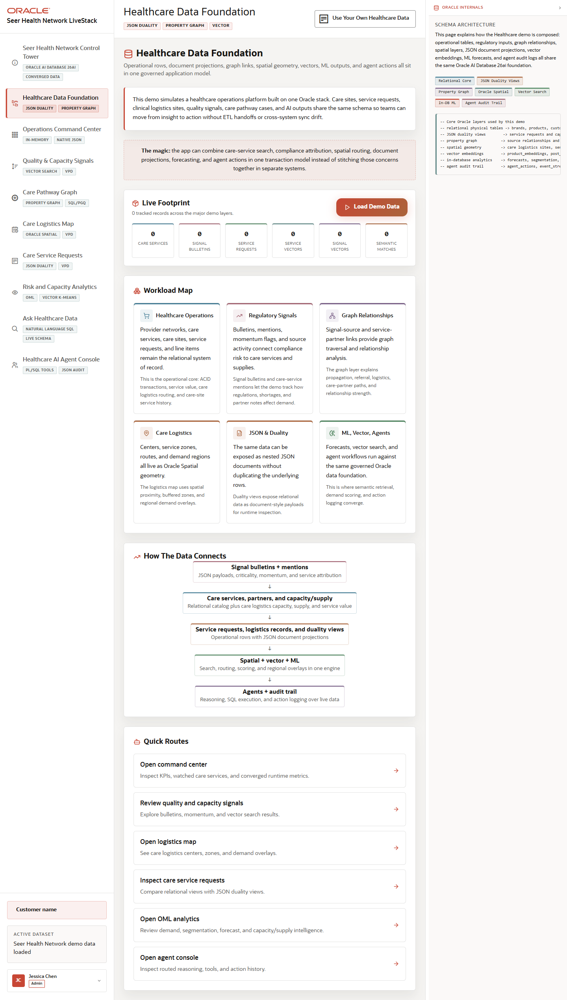

# Scene 1 Healthcare Data Foundation

## Introduction

This scene establishes the operating model behind the demo. The Healthcare Data Foundation page explains how care services, service requests, quality signal bulletins, spatial logistics data, graph links, vectors, ML outputs, and agent audit records share one Oracle AI Database 26ai foundation.

Estimated Time: 8 minutes

### Objectives

In this lab, you will:
- Open the Healthcare Data Foundation scene from the left navigation.
- Inspect the data domains that feed the rest of the Healthcare LiveStack.
- Use the quick route buttons to connect the foundation view to operational scenes.

## Task 1: Open the data foundation

1. Click **Healthcare Data Foundation** in the left navigation.
2. Review the top summary explaining operational rows, document projections, graph links, spatial geometry, vectors, ML outputs, and agent actions.
3. Inspect the data volume cards for care services, signal bulletins, service requests, service vectors, signal vectors, and semantic matches.

Expected result:
- The page frames the demo as one application model instead of separate specialty systems.
- The visible counts and workload labels show which data structures power the downstream scenes.

## Task 2: Follow the workload map

1. Review the healthcare workload map and the flow from clinical or operational signals into Oracle Database features.
2. Click one quick route, such as **Open command center** or **Open logistics map**, and confirm the application navigates to that scene.
3. Return to **Healthcare Data Foundation** from the navigation.

Expected result:
- The foundation scene acts as the explanatory hub for the application.
- The quick route confirms that each later scene is grounded in the same shared data model.

## Task 3: Why this matters?

Healthcare operations teams often reconcile care capacity, service requests, quality signals, and logistics data across different systems. This scene shows the opposite pattern: the demo can move across workloads because Oracle AI Database 26ai keeps the operational, document, graph, vector, spatial, ML, and audit evidence together.

## Credits & Build Notes
- **Author** - Oracle LiveStack Team
- **Last Updated By/Date** - Oracle LiveStack Team, 2026-05-13
