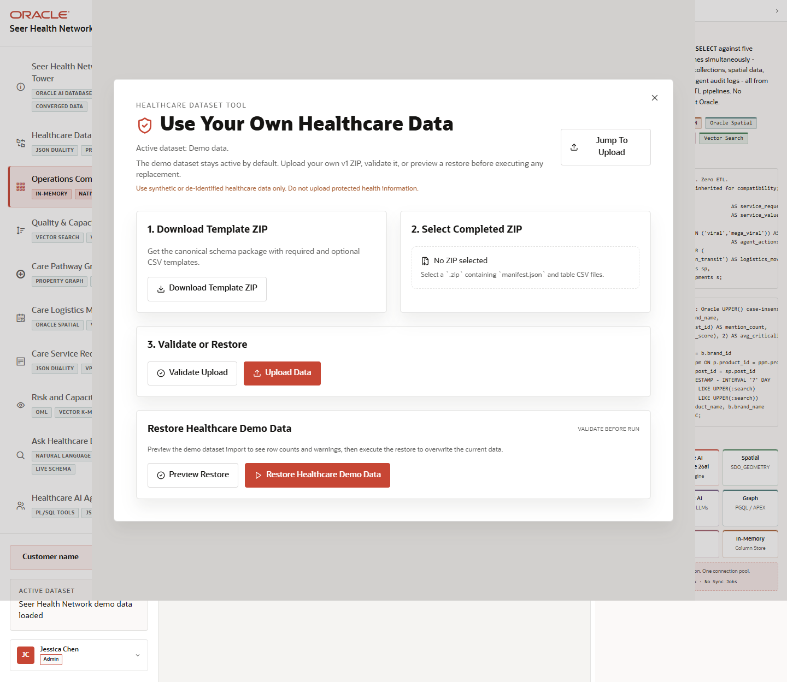

# Scene 10 Bring Your Own Healthcare Data

## Introduction

This operator workflow shows how a demo user can replace or restore the healthcare dataset through the application. The workflow supports downloading a template ZIP, selecting a completed ZIP, validating it, uploading it, and restoring the seeded demo data.

Estimated Time: 10 minutes

### Objectives

In this lab, you will:
- Open the dataset tool from the application top bar.
- Download the template package and review the expected upload flow.
- Validate, upload, or restore data using the visible controls.

## Task 1: Open the dataset tool

1. From any application scene, click **Use Your Own Healthcare Data** in the top bar.
2. Review the three main sections: **Download Template ZIP**, **Select Completed ZIP**, and **Validate or Restore**.
3. Note the active dataset label in the application sidebar.

Expected result:
- The dataset tool opens as a modal over the current scene.
- The workflow tells the user how to prepare a ZIP with `manifest.json` and table CSV files.

## Task 2: Validate or restore data

1. Click **Download Template** to retrieve the expected import structure.
2. Select a completed dataset ZIP.
3. Click **Validate ZIP** before uploading, or use **Preview Restore** and **Restore Demo Data** to return to the seeded healthcare dataset.

Expected result:
- Validation returns row counts, warnings, or issues before data replacement.
- Upload and restore actions are explicit, reducing the chance of accidental dataset changes during a demo.

## Task 3: Why this matters?

A useful industry LiveStack should be portable to a customer's terminology and sample data. This workflow makes the demo more than a static showcase: it gives teams a governed path to validate their own healthcare dataset while preserving a known-good seeded baseline.

## Credits & Build Notes
- **Author** - Oracle LiveStack Team
- **Last Updated By/Date** - Oracle LiveStack Team, 2026-05-13
