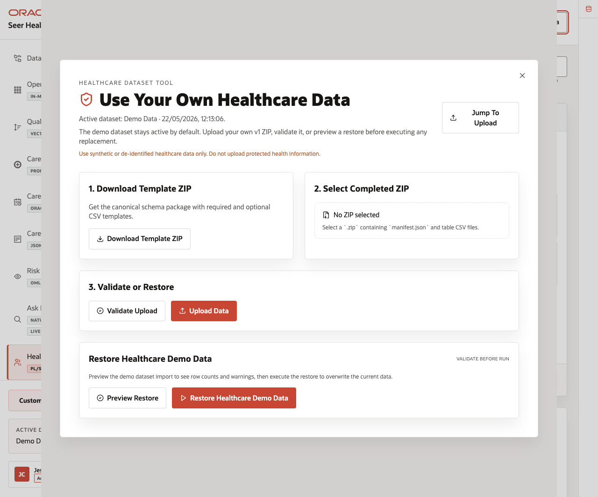

# Scene 11 Bring Your Own Healthcare Data

## Introduction

This operator workflow shows how a demo user can replace or restore the healthcare dataset through the application. The workflow supports downloading a template ZIP, selecting a completed ZIP, validating it, uploading it, and restoring the seeded demo data.

This scene matters because a healthcare LiveStack is most useful when teams can map the demo pattern to their own terminology and sample data. The application makes that workflow explicit while keeping the seeded Seer Health Network data available as a known-good baseline.

Estimated Time: 10 minutes

### Objectives

In this scene, you will:
- Open the dataset tool from the application top bar.
- Review the active dataset label.
- Download the canonical healthcare dataset template.
- Review the completed ZIP upload and validation path.
- Preview or restore the seeded healthcare demo dataset.
- Explain the data safety expectation for synthetic or de-identified healthcare data.

## Task 1: Open the dataset tool

1. From any application scene, click **Use Your Own Healthcare Data** in the top bar.
2. Review the modal title and active dataset line.
3. Confirm that the modal warns users to use synthetic or de-identified healthcare data only and not to upload protected health information.
4. Review the main sections: **Download Template ZIP**, **Select Completed ZIP**, **Validate or Restore**, and **Restore Healthcare Demo Data**.

In the current demo, the modal shows the active dataset as **Demo Data** and provides a workflow for a v1 ZIP that contains `manifest.json` and table CSV files.

## Task 2: Review the template and upload workflow

1. Click **Download Template ZIP** to download the canonical schema package.
2. Review **Select Completed ZIP**. The control expects a `.zip` containing `manifest.json` and table CSV files.
3. Review the **Validate Upload** and **Upload Data** actions.
4. Explain that validation should run before data replacement.

This workflow helps keep custom demos repeatable. The template sets the expected structure, validation checks the completed ZIP before import, and upload remains an explicit action.

## Task 3: Preview or restore the seeded dataset

1. In **Restore Healthcare Demo Data**, click **Preview Restore**.
2. Review the row counts, warnings, or issues returned by the preview.
3. If you need to return the demo to the seeded baseline, click **Restore Healthcare Demo Data** after the preview enables the action.
4. Close the dataset manager when finished.

Use this scene to explain the operating guardrail. Teams can bring their own synthetic or de-identified healthcare data into the LiveStack, but the seeded dataset remains available so the demo can always return to a known baseline.

You can move to the download lab when you want to run the Healthcare LiveStack locally.

## Credits & Build Notes
- **Author** - Oracle LiveLabs Team
- **Last Updated By/Date** - Oracle LiveLabs Team, 2026-05-22
