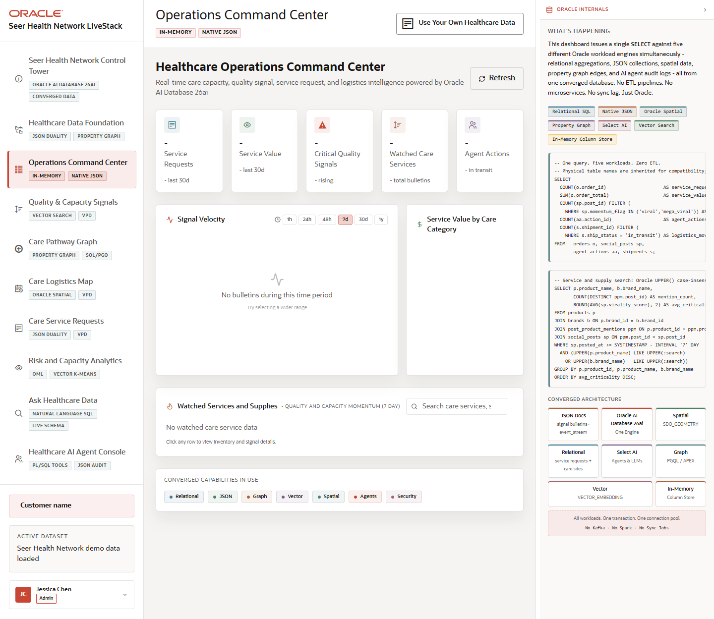

# Scene 2 Operations Command Center

## Introduction

The Operations Command Center is the executive operating view. It brings care capacity, service value, critical quality signals, watched care services, logistics movement, and AI agent activity into one screen.

Estimated Time: 10 minutes

### Objectives

In this lab, you will:
- Open the command center and review the executive KPI cards.
- Change the signal velocity time window.
- Search or filter watched services and inspect how the Oracle evidence panel explains the query.

## Task 1: Review the executive view

1. Click **Operations Command Center** in the left navigation.
2. Review the KPI cards for service requests, service value, critical quality signals, watched care services, and agent actions.
3. Inspect the **What's Happening** panel on the right.

Expected result:
- The page presents a single operational picture instead of forcing the user into separate dashboards.
- The right panel explains that the screen pulls from relational SQL, native JSON, spatial, graph, Select AI, vector search, and In-Memory capabilities.

## Task 2: Interact with command center controls

1. Click a signal velocity time range such as **24h**, **48h**, or **7d**.
2. Use the watched services search box to filter for a care service, supply, or partner.
3. Click a watched service row when data is available to open details and compare operational attributes with the JSON view.

Expected result:
- The chart and watched services area respond to filter changes.
- When the full stack is running with seeded data, row details expose both operator-friendly values and Oracle-backed evidence.

## Task 3: Why this matters?

The command center is the fastest way to show the business payoff of the LiveStack. A healthcare leader can see demand, capacity, quality risk, service movement, and agent actions without waiting for a separate analytics pipeline.

## Credits & Build Notes
- **Author** - Oracle LiveStack Team
- **Last Updated By/Date** - Oracle LiveStack Team, 2026-05-13
