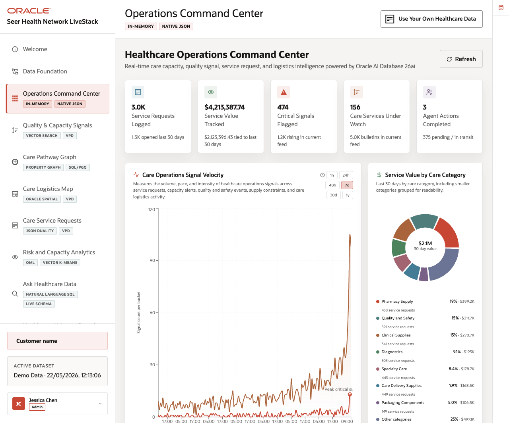
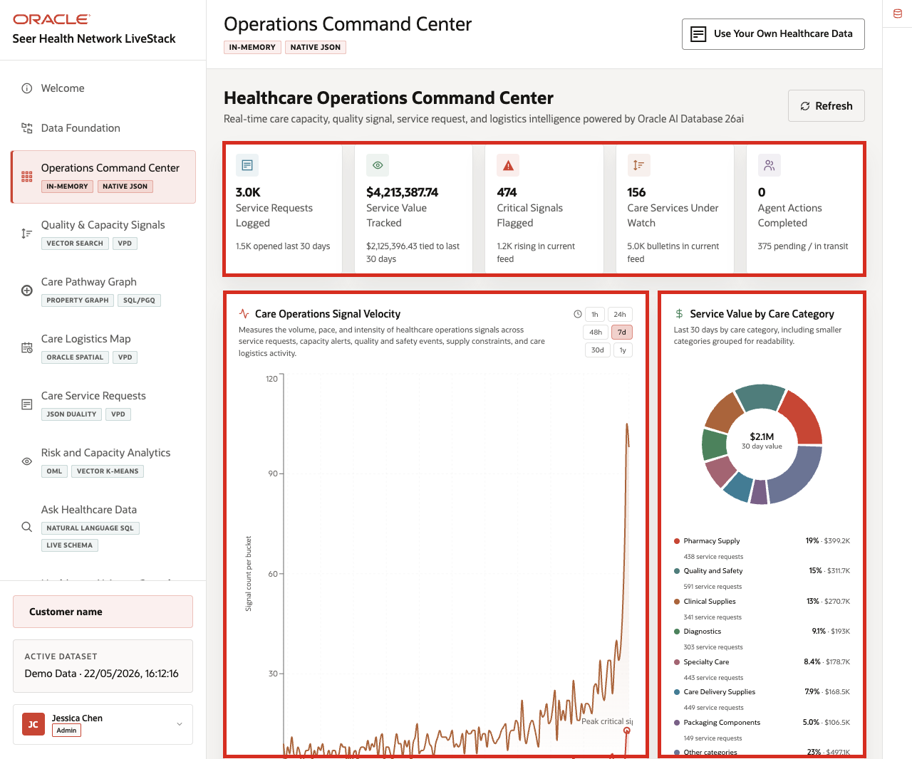
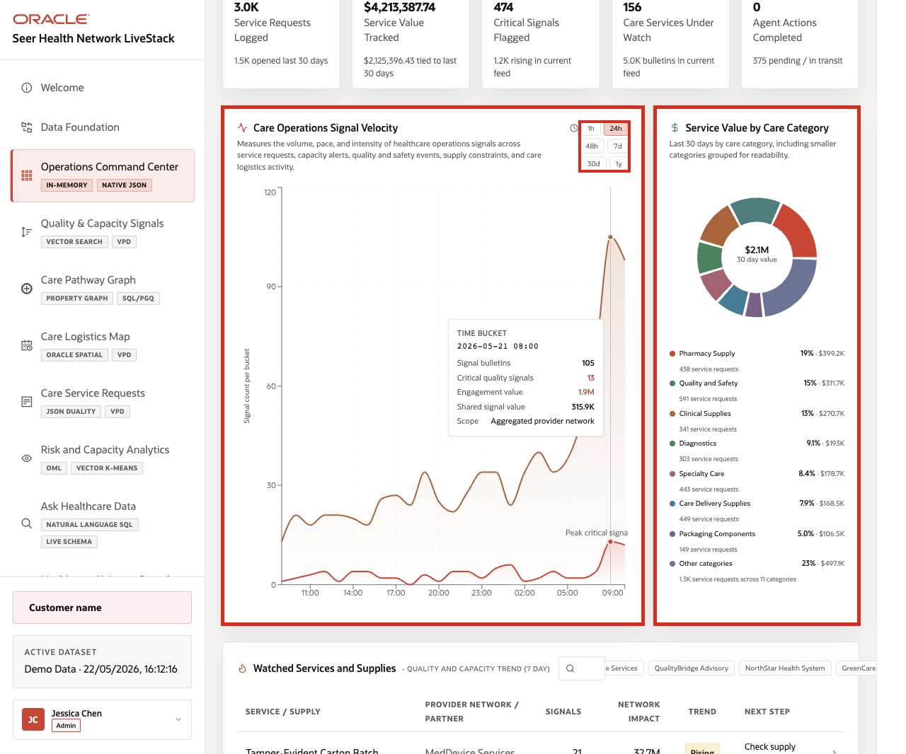
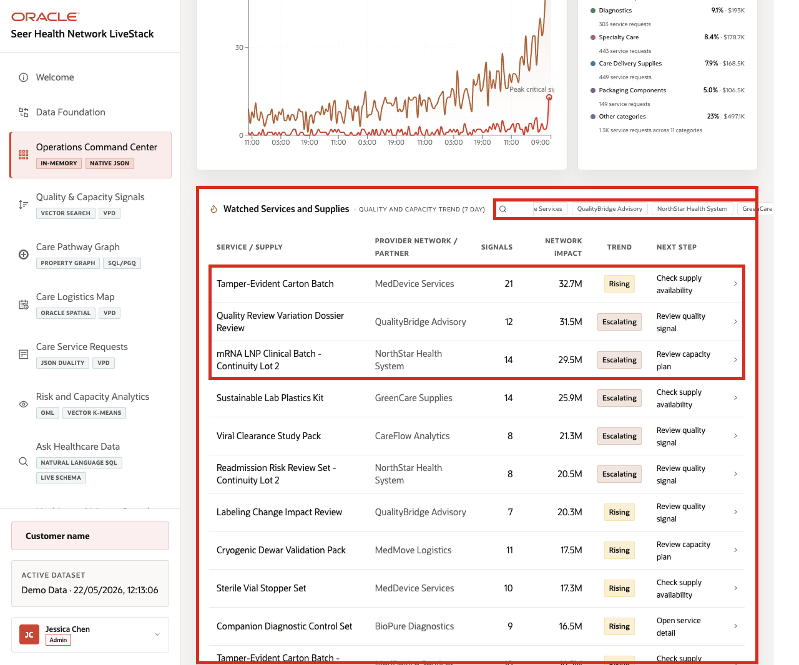

# Scene 3 Operations Command Center

## Introduction

The Healthcare Operations Command Center is built for a healthcare operations leader, service line owner, capacity planner, or provider-network analyst who needs a daily operating view of care demand, service value, quality signals, logistics pressure, and AI-assisted actions. The goal is to see where the network is under pressure before the issue becomes a separate escalation.

Dashboards like this are difficult to implement when care sites, service requests, signal bulletins, supply data, logistics networks, and agent activity live in different systems. Teams often need copied extracts, separate BI models, and reconciliation logic before a dashboard can show a trustworthy view.

Oracle AI Database helps address that challenge by keeping operational, analytical, JSON, in-memory, and AI-ready data close to the same governed data foundation. In this scene, the dashboard brings together live healthcare KPIs, signal velocity, care category value, and watched services without sending the user to another application.

Estimated Time: 10 minutes

### Objectives

In this scene, you will:
- Review the command center as a healthcare operations user.
- Interpret the KPI cards, care operations signal velocity chart, service value chart, and watched services table.
- Change the signal velocity time window.
- Search or filter watched services and supplies.
- Use the **Oracle Internals** sidebar to explain why this dashboard can stay connected to governed Oracle data.

## Task 1: Review the command center dashboard

1. Click **Operations Command Center** in the sidebar.
2. Review the KPI cards across the top of the page.
3. Review **Care Operations Signal Velocity**.
4. Review **Service Value by Care Category**.
5. Review **Watched Services and Supplies - Quality and Capacity Trend**.

    

6. Open or review the **Oracle Internals** sidebar on the right.

In the current demo dataset, the page shows **3.0K** service requests logged, about **$4.21M** in tracked service value, **474** critical signals flagged, **156** care services under watch, and **1** completed agent action. Use those numbers to frame the command center as a triage surface: the user can see demand, value, signal pressure, watched services, and AI activity in one place.

## Task 2: Interpret signal velocity and service value

1. Click a signal velocity time range such as **24h**, **48h**, or **7d**.
2. Review how the signal chart changes by time bucket.
3. Review the service value chart by care category.
4. Focus on visible categories such as **Pharmacy Supply**, **Quality and Safety**, **Clinical Supplies**, **Diagnostics**, and **Specialty Care**.

    

This is the business story to emphasize: healthcare users need to know where value, volume, and risk are moving together. A category with high service value and rising quality signals may need a different operating response than a low-value category with stable capacity.

## Task 3: Review watched services and supplies

1. Use the watched services search box to filter for a care service, supply, or partner.
2. Review the top watched rows.

    

3. Focus on rows such as **Tamper-Evident Carton Batch**, **Quality Review Variation Dossier Review**, or **mRNA LNP Clinical Batch - Continuity Lot 2**.
4. Review the columns for provider network or partner, signal count, network impact, trend, and next step.

The watched services table turns the KPI story into a set of operating decisions. A healthcare leader can move from "critical signals are high" to a specific care service, supplier, or quality process that needs review.

You can move to the next scene.

## Credits & Build Notes
- **Author** - Oracle LiveLabs Team
- **Last Updated By/Date** - Oracle LiveLabs Team, 2026-05-22
