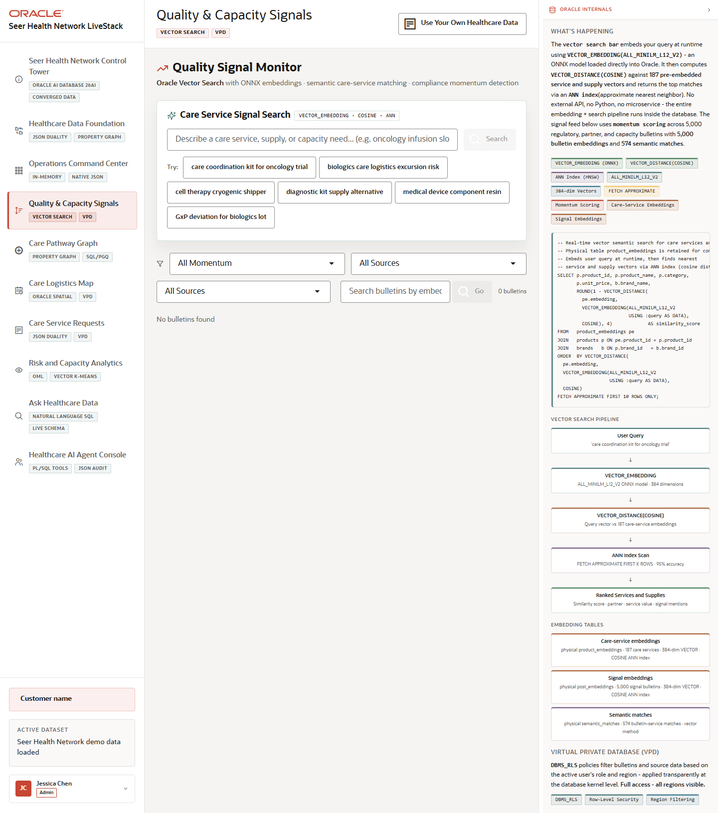

# Scene 3 Quality and Capacity Signals

## Introduction

This scene demonstrates how the application turns healthcare bulletins, partner updates, service notes, and capacity signals into searchable operational intelligence using in-database vectors and governed access controls.

Estimated Time: 10 minutes

### Objectives

In this lab, you will:
- Open the quality and capacity signal feed.
- Run a semantic search for a care service or capacity need.
- Review how VPD and vector search are described in the Oracle evidence panel.

## Task 1: Open the signal feed

1. Click **Quality & Capacity Signals** in the left navigation.
2. Review the filter controls for momentum, source, influencer or signal source, and bulletin text search.
3. Inspect the right-side explanation of vector search and VPD.

Expected result:
- The page shows a searchable operating feed for quality and capacity events.
- The Oracle panel connects the user-facing feed to `VECTOR_EMBEDDING`, `VECTOR_DISTANCE`, and database-level access policy behavior.

## Task 2: Run semantic search

1. In **Care Service Signal Search**, enter a phrase such as `oncology infusion slot capacity`.
2. Click **Search** or choose one of the example query buttons.
3. Review the returned matches and their similarity or relevance evidence.

Expected result:
- The search returns semantically related care services or operational signals when the full stack is connected to seeded vectors.
- The result demonstrates meaning-based retrieval rather than simple keyword matching.

## Task 3: Why this matters?

Healthcare teams need to recognize quality and capacity risks before they become service failures. This scene shows how Oracle AI Database can embed and compare operational signals where the governed data already lives, so search results remain explainable and policy controlled.

## Credits & Build Notes
- **Author** - Oracle LiveStack Team
- **Last Updated By/Date** - Oracle LiveStack Team, 2026-05-13
