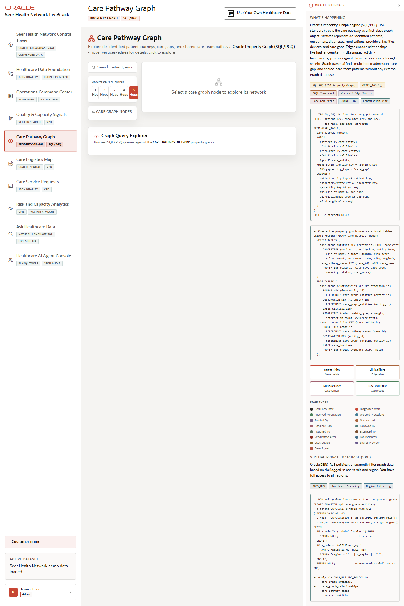

# Scene 4 Care Pathway Graph

## Introduction

The Care Pathway Graph scene uses graph relationships to explore patients, encounters, providers, facilities, care gaps, and quality-signal relationships without moving the data to a separate graph database.

Estimated Time: 10 minutes

### Objectives

In this lab, you will:
- Open the care pathway graph scene.
- Search for a care entity or select a graph node.
- Run an example SQL/PGQ query and review the relationship evidence.

## Task 1: Explore the graph scene

1. Click **Care Pathway Graph** in the left navigation.
2. Review the graph visualization area, entity search box, and depth controls.
3. Select a patient, encounter, care gap, provider, or facility node when graph data is available.

Expected result:
- The graph view exposes connected care relationships rather than isolated records.
- Depth controls make it clear when the view expands from direct relationships to multi-hop patterns.

## Task 2: Run an example graph query

1. Open the example query panel.
2. Select a provided graph query.
3. Review the query text, parameters, and result table.

Expected result:
- The application shows how SQL/PGQ-style graph questions can run against the healthcare schema.
- The selected query returns relationship evidence that can be explained in operational terms, such as care-gap patterns or shared-care-team relationships.

## Task 3: Why this matters?

Many healthcare risks are relationship problems: the same patient, site, provider, and quality signal may appear harmless alone but important together. This scene shows how graph analysis helps users find those patterns inside the same governed platform.

## Credits & Build Notes
- **Author** - Oracle LiveStack Team
- **Last Updated By/Date** - Oracle LiveStack Team, 2026-05-13
