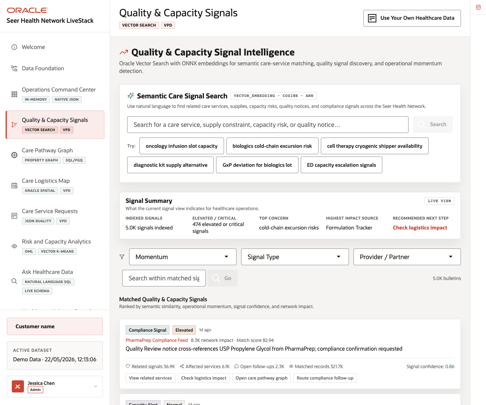
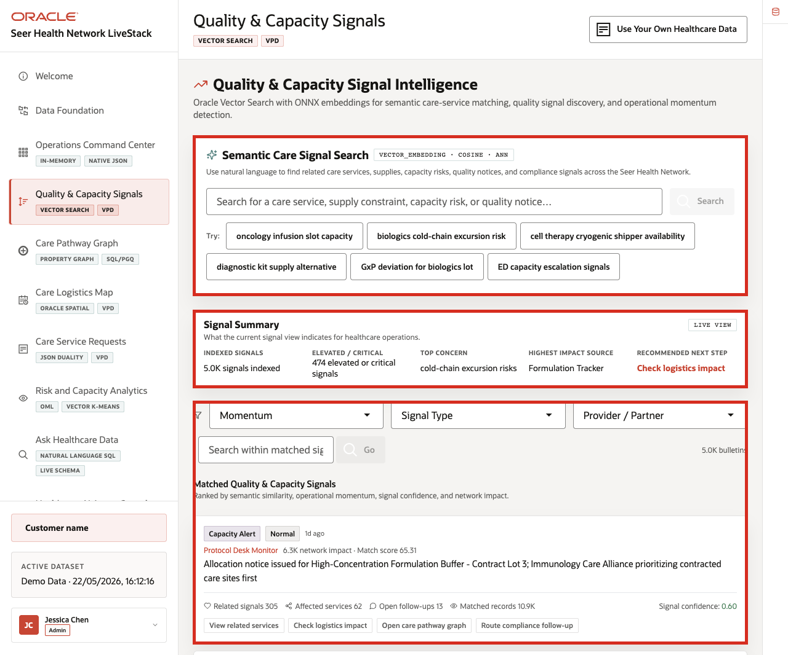
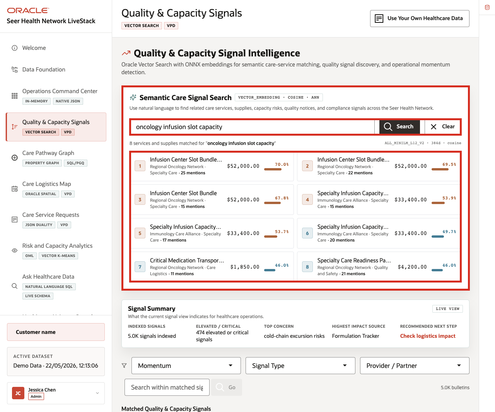
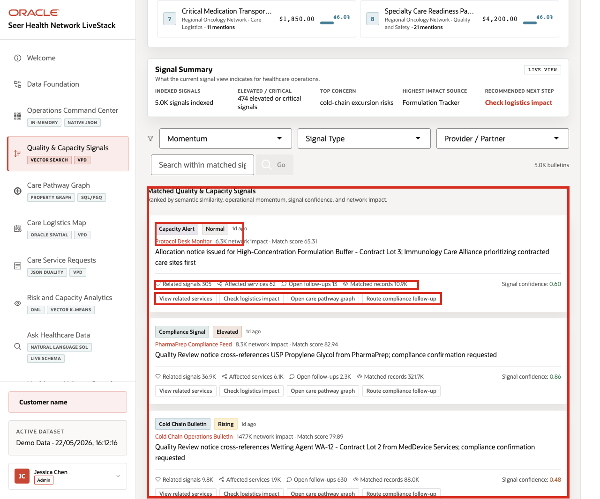

# Scene 4 Quality and Capacity Signals

## Introduction

A quality leader, capacity planner, service line manager, or supply operations analyst uses this page to understand what healthcare signals are saying before the risk is obvious in request volume alone. This persona is looking for patterns in quality bulletins, supply constraints, partner updates, compliance notes, logistics alerts, and care-service mentions. The goal is to connect operational language to affected services quickly enough to act.

Semantic search is difficult to implement when signals, care-service catalogs, embeddings, search indexes, and access policies live in separate systems. Healthcare teams often have to move sensitive operational text into external search services, synchronize vector indexes, and then rebuild access control outside the database.

Oracle AI Database helps address these challenges by keeping vector search close to the governed healthcare data. In this LiveStack Demo, the page uses natural-language search over service and signal embeddings, shows match evidence, and keeps the operating feed tied to database access policies.

Estimated Time: 10 minutes

### Objectives

In this scene, you will:
- Review the **Quality & Capacity Signals** workspace.
- Run a semantic search for an oncology capacity phrase.
- Inspect matched care services and supplies.
- Review the signal summary and matched quality and capacity signal cards.
- Understand why vector search and governed access matter for healthcare signal discovery.

## Task 1: Review the signal feed

1. Click **Quality & Capacity Signals** in the sidebar.
2. Review **Semantic Care Signal Search** at the top of the page.
3. Review the example query chips, including **oncology infusion slot capacity**, **biologics cold-chain excursion risk**, and **cell therapy cryogenic shipper availability**.
4. Review the **Signal Summary** cards.
5. Review the **Matched Quality & Capacity Signals** feed below the summary.

    

In the current demo dataset, the signal summary shows **5.0K** indexed signals, **474** elevated or critical signals, **cold-chain excursion risks** as the top concern, **Formulation Tracker** as the highest impact source, and **Check logistics impact** as the recommended next step.

## Task 2: Run semantic care-service search

1. Click the **oncology infusion slot capacity** example query chip, or enter that phrase in the search field.
2. Click **Search**.

    

3. Review the matched services and supplies returned above the signal summary.
4. Focus on the top matches: **Infusion Center Slot Bundle - Continuity Lot 2**, **Infusion Center Slot Bundle - Continuity Lot 3**, and **Infusion Center Slot Bundle**.

In the current demo dataset, the search returns **8** matched services and supplies for `oncology infusion slot capacity`. The top result is **Infusion Center Slot Bundle - Continuity Lot 2** from **Regional Oncology Network**, in **Specialty Care**, with a visible similarity score of about **70%**. This is the data point to emphasize: the search is not simply matching a keyword. It is finding semantically related care services and supplies by comparing vector embeddings.

## Task 3: Interpret the signal cards

1. Scroll to **Matched Quality & Capacity Signals**.
2. Review the signal type, criticality, source, network impact, match score, related signals, affected services, and open follow-ups.
3. Use the action labels such as **View related services**, **Check logistics impact**, **Open care pathway graph**, and **Route compliance follow-up** to explain where the operator could go next.

    

The value of Oracle AI Database is that operational text can become searchable healthcare intelligence without leaving the governed data platform. Vector search helps users find related signals by meaning, while the Oracle-backed application still shows source, score, and operating context.

You can move to the next scene.

## Credits & Build Notes
- **Author** - Oracle LiveLabs Team
- **Last Updated By/Date** - Oracle LiveLabs Team, 2026-05-22
