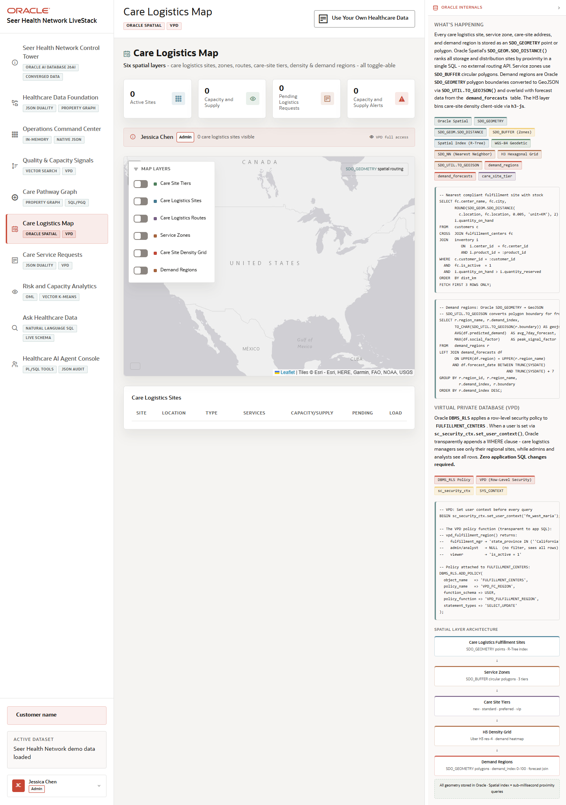

# Scene 5 Care Logistics Map

## Introduction

The Care Logistics Map uses Oracle Spatial data to show care logistics sites, service zones, care-site tiers, route overlays, density grids, and demand regions in a single operator view.

Estimated Time: 10 minutes

### Objectives

In this lab, you will:
- Open the map and inspect the available spatial layers.
- Toggle care logistics sites, service zones, routes, care-site tiers, density, and demand regions.
- Compare map evidence with the care logistics site table.

## Task 1: Open the spatial operating view

1. Click **Care Logistics Map** in the left navigation.
2. Review the stat cards at the top of the scene.
3. Inspect the map legend and the six layer toggles.

Expected result:
- The scene opens as a geographic operating view for care logistics decisions.
- The layer controls make the map useful for different roles, from care-site access to capacity planning.

## Task 2: Compare layers and site data

1. Turn on **Care Logistics Sites** and **Demand Regions**.
2. Add **Service Zones** or **Care Logistics Routes** to compare service area coverage.
3. Review the **Care Logistics Sites** table below the map.

Expected result:
- The visible map changes as layers are toggled.
- The site table grounds the map in concrete operational records, while the Oracle panel explains the spatial functions and VPD pattern behind the view.

## Task 3: Why this matters?

Healthcare logistics decisions depend on where demand, capacity, and constraints occur. This scene makes location data part of the same operational application, helping users compare service access, route impact, and regional demand without exporting to a separate GIS workflow.

## Credits & Build Notes
- **Author** - Oracle LiveStack Team
- **Last Updated By/Date** - Oracle LiveStack Team, 2026-05-13
