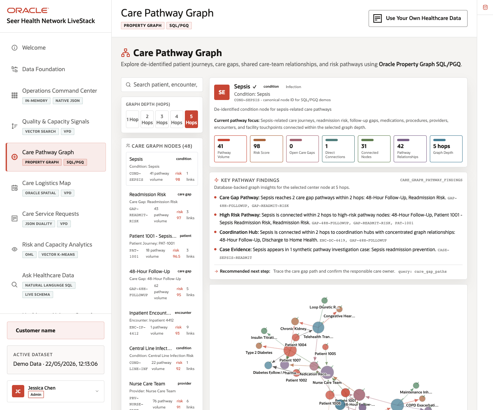
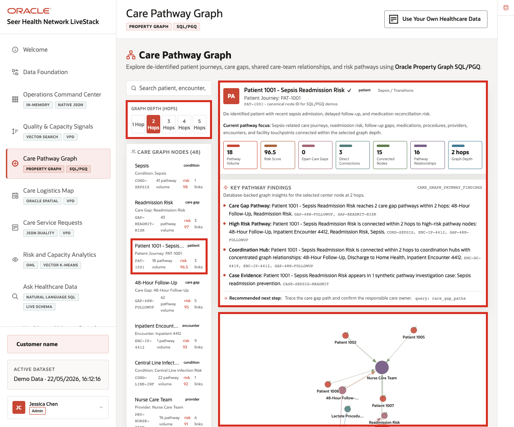
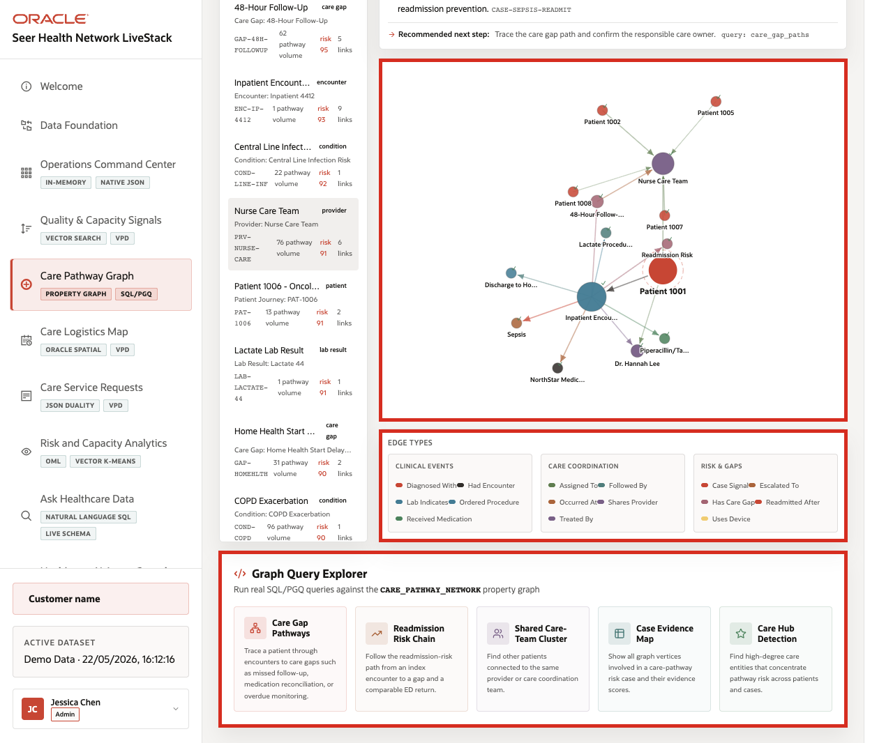

# Scene 5 Care Pathway Graph

## Introduction

A care coordination leader, clinical operations analyst, population health user, or data architect uses this page to understand healthcare relationships that are hard to see in isolated rows. The persona needs to reason across de-identified patient journeys, encounters, providers, facilities, conditions, medications, lab results, procedures, care gaps, and quality signals.

This is difficult when relationship analysis requires data movement into a separate graph database or offline notebook. Healthcare users may know there is a pathway risk, but they need to see how a patient journey connects to care gaps, care teams, facilities, and quality signals without losing governance.

Oracle AI Database helps address these challenges by supporting graph analysis over the operational healthcare schema. In this scene, the application exposes care pathway relationships while the sidebar explains the Oracle Property Graph and SQL/PGQ pattern behind the view.

Estimated Time: 10 minutes

### Objectives

In this scene, you will:
- Review the **Care Pathway Graph** workspace.
- Inspect graph depth controls and the care graph node list.
- Focus on concrete pathway-risk nodes.
- Explain how graph relationships help identify connected care risk.
- Connect the user-facing graph to Oracle Property Graph and SQL/PGQ.

## Task 1: Review the graph workspace

1. Click **Care Pathway Graph** in the sidebar.
2. Review the graph depth controls: **1 Hop**, **2 Hops**, **3 Hops**, **4 Hops**, and **5 Hops**.
3. Review the search field for patient, encounter, care gap, or provider lookup.
4. Review **Care Graph Nodes**.
5. Open or review the **Oracle Internals** sidebar on the right.

    

In the current demo dataset, the page shows **48** care graph nodes. Visible nodes include **Sepsis**, **Readmission Risk**, **Patient 1001 - Sepsis Readmission Risk**, **48-Hour Follow-Up**, **Inpatient Encounter 4412**, **Central Line Infection Risk**, **Nurse Care Team**, **Piperacillin/Tazobactam**, and **Dr. Hannah Lee - Hospitalist**.

## Task 2: Explore a pathway-risk example

1. In the node list, locate **Patient 1001 - Sepsis Readmission Risk**.
2. Review the node type, identifier, pathway volume, risk score, and link count.
3. Compare it with nearby care-gap and encounter nodes such as **Readmission Risk**, **48-Hour Follow-Up**, and **Inpatient Encounter 4412**.
4. Change the graph depth from **1 Hop** to **2 Hops** or **3 Hops** to explain how relationship scope changes.

    

Use this example to explain why graph context matters. A patient journey, readmission-risk care gap, encounter, medication, provider, and facility are more informative together than as independent records. The graph view helps the operator see the pathway as connected evidence.

## Task 3: Explain the Oracle graph pattern

1. Review the **Graph Query Explorer** area.
2. Review the Oracle Internals content that references property graph and SQL/PGQ.
3. Explain that the graph is an analysis view over governed healthcare data rather than a disconnected copy.

    

The value of Oracle AI Database is that healthcare teams can ask relationship-aware questions inside the same governed platform that stores the operational data. That reduces data movement and lets the graph story stay connected to the rest of the demo.

You can move to the next scene.

## Credits & Build Notes
- **Author** - Oracle LiveLabs Team
- **Last Updated By/Date** - Oracle LiveLabs Team, 2026-05-22
