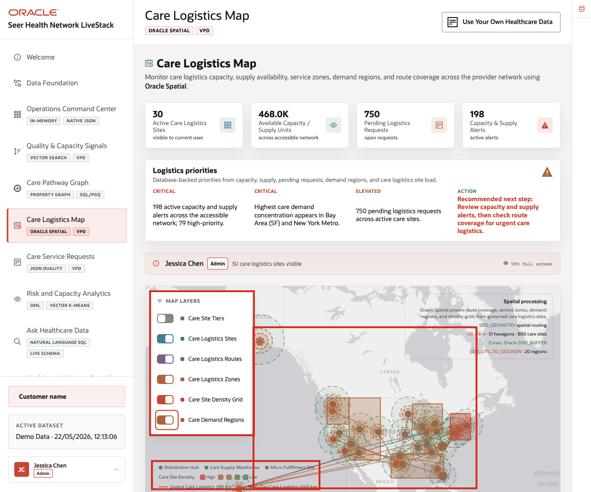
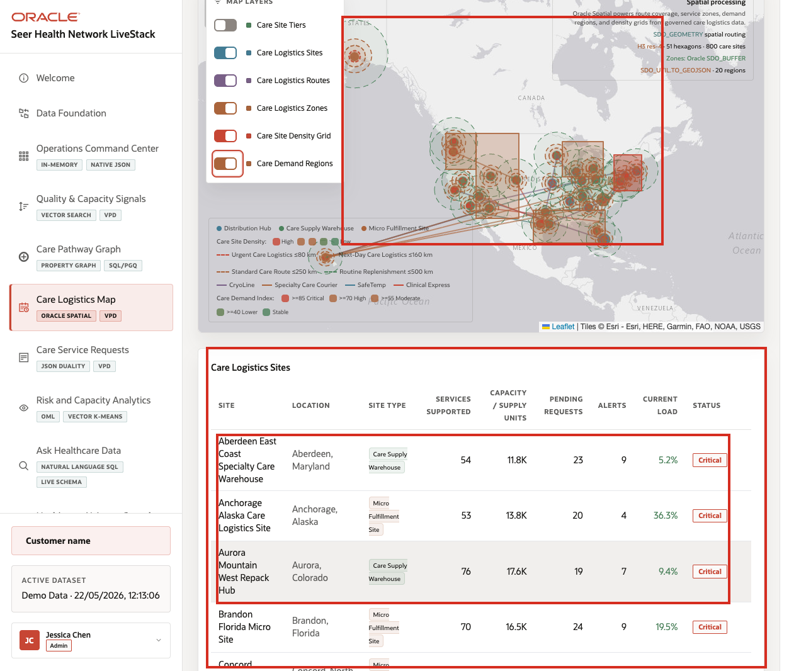

# Scene 6 Care Logistics Map

## Introduction

A care logistics manager, capacity planner, emergency operations lead, or supply network analyst uses this page to understand where care demand, site capacity, supply constraints, and logistics coverage intersect. This persona needs a geographic operating view, not just a list of sites.

Location-aware healthcare decisions are difficult when care sites, logistics sites, routes, service zones, density grids, and demand regions live outside the operational data platform. Teams may export to a GIS tool, but then lose the connection to current service requests, supply levels, access controls, and operational status.

Oracle AI Database helps address these challenges by keeping spatial geometry and operational records together. In this scene, Oracle Spatial powers care logistics sites, routes, service zones, demand regions, and proximity context in the same application that manages the rest of the healthcare data.

Estimated Time: 10 minutes

### Objectives

In this scene, you will:
- Review the **Care Logistics Map** as a geographic operating view.
- Interpret the capacity, pending request, and alert cards.
- Toggle map layers for sites, routes, zones, density, and demand regions.
- Compare map evidence with the care logistics site table.
- Explain how Oracle Spatial supports location-aware healthcare decisions.

## Task 1: Review logistics priorities

1. Click **Care Logistics Map** in the sidebar.
2. Review the stat cards across the top of the page.
3. Review **Logistics priorities** to the right of the cards.
4. Review the active user and VPD banner.

    

In the current demo dataset, the page shows **30** active care logistics sites visible to the current user, about **468.0K** available capacity or supply units, **750** pending logistics requests, and **198** active capacity and supply alerts. The priority panel flags **79** high-priority alerts, demand concentration in **Bay Area (SF)** and **New York Metro**, and a recommendation to review capacity and supply alerts before checking route coverage.

## Task 2: Toggle spatial layers

1. Review the map and its layer controls.
2. Toggle **Care Logistics Sites**.
3. Toggle **Care Logistics Routes** and **Care Logistics Zones**.
4. Toggle **Care Site Density Grid** and **Care Demand Regions**.
5. Review how the map changes as layers are added or removed.

    

The layer controls make the same map useful for different questions. A capacity planner may start with demand regions and density. A logistics coordinator may focus on care logistics sites and routes. A compliance user may compare service zones with capacity alerts.

## Task 3: Compare site data with the map

1. Scroll to the **Care Logistics Sites** table.
2. Review columns for site location, site type, services supported, capacity or supply units, pending requests, alerts, current load, and status.
3. Focus on visible sites such as **Aberdeen East Coast Specialty Care Warehouse**, **Anchorage Alaska Care Logistics Site**, **Aurora Mountain West Repack Hub**, **Concord Southeast Micro Site**, and **Edison Northeast Care Logistics Depot**.
4. Use the table to connect map markers to concrete operating records.

    

The value of Oracle AI Database is that location intelligence is not detached from the operational data. Oracle Spatial can support route coverage and proximity analysis while the application still shows capacity, requests, alerts, and VPD-aware access from the same data foundation.

You can move to the next scene.

## Credits & Build Notes
- **Author** - Oracle LiveLabs Team
- **Last Updated By/Date** - Oracle LiveLabs Team, 2026-05-22
