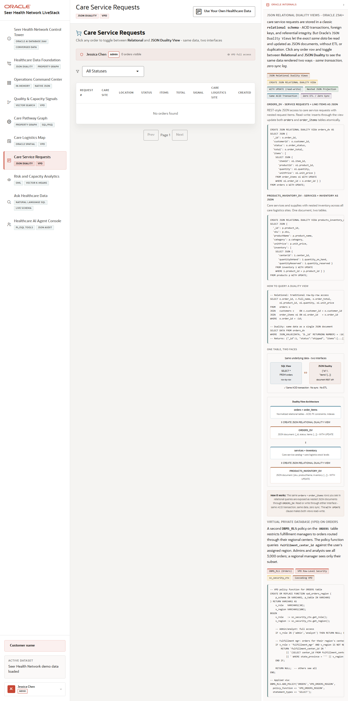

# Scene 6 Care Service Requests

## Introduction

This scene demonstrates service request operations and JSON duality. Users can review care service requests, filter by status, and inspect the same request as relational rows, a JSON duality document, and a logistics route.

Estimated Time: 10 minutes

### Objectives

In this lab, you will:
- Open the care service request list.
- Filter requests by status.
- Open a request detail and compare relational, JSON duality, and route views.

## Task 1: Inspect service requests

1. Click **Care Service Requests** in the left navigation.
2. Use the status filter to select a request state such as **Shipped**, **Delivered**, or **Pending**.
3. Review the request table and pagination controls.

Expected result:
- The list narrows to the selected service request state.
- The page explains how VPD can restrict what different users see.

## Task 2: Compare the request detail views

1. Click a request row when seeded data is available.
2. In the detail panel, review the **Relational** tab.
3. Switch to **JSON Duality View**, then to **Logistics Route**.

Expected result:
- The relational tab shows normalized request and item values.
- The JSON duality tab exposes the same operational request as a document.
- The route tab connects request fulfillment to spatial evidence.

## Task 3: Why this matters?

Healthcare service requests are both operational transactions and documents that applications need to consume quickly. This scene shows how JSON duality lets teams work with document-shaped APIs while preserving relational integrity, governance, and spatial context.

## Credits & Build Notes
- **Author** - Oracle LiveStack Team
- **Last Updated By/Date** - Oracle LiveStack Team, 2026-05-13
