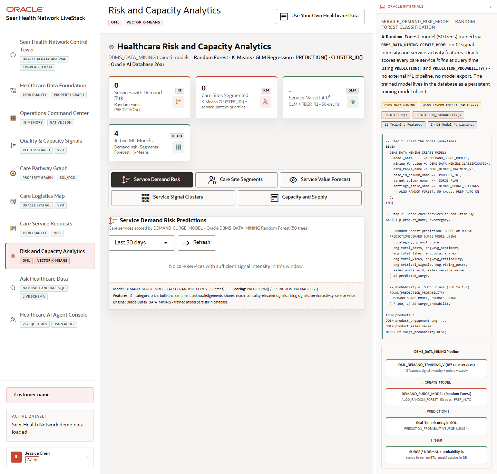

# Scene 7 Risk and Capacity Analytics

## Introduction

The Risk and Capacity Analytics scene demonstrates in-database analytics for healthcare operations. It includes service demand risk, care-site segmentation, service value forecasts, service and signal vector clustering, and capacity and supply intelligence.

Estimated Time: 12 minutes

### Objectives

In this lab, you will:
- Open the OML analytics scene.
- Move across the five analytics tabs.
- Run or refresh an analytics view and connect the output to operational decisions.

## Task 1: Review the analytics tabs

1. Click **Risk and Capacity Analytics** in the left navigation.
2. Review the page summary and active model cards.
3. Click each tab: **Service Demand Risk**, **Care Site Segments**, **Service Value Forecast**, **Service Signal Clusters**, and **Capacity and Supply**.

Expected result:
- Each tab changes the visible analytic workflow.
- The Oracle evidence panel changes with the selected tab and explains the model or SQL pattern behind the output.

## Task 2: Run an analytics workflow

1. In **Service Demand Risk**, select a lookback window and run or refresh predictions.
2. In **Service Signal Clusters**, choose a cluster count when available.
3. In **Capacity and Supply**, review alerts and capacity indicators.

Expected result:
- The scene shows DBMS_DATA_MINING, `PREDICTION()`, `CLUSTER_ID()`, and related SQL-driven analytics as application features.
- The outputs help explain where care demand, capacity, supply, or risk needs attention.

## Task 3: Why this matters?

Healthcare operations teams need predictive and segmentation signals, but exporting data to another model environment creates latency and governance concerns. This scene demonstrates analytics that stay close to the governed data and can be surfaced directly in the operating workflow.

## Credits & Build Notes
- **Author** - Oracle LiveStack Team
- **Last Updated By/Date** - Oracle LiveStack Team, 2026-05-13
