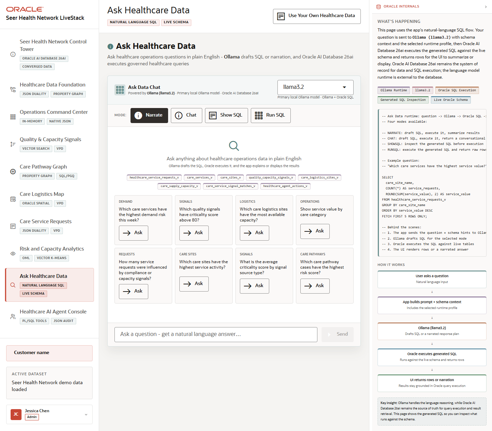

# Scene 8 Ask Healthcare Data

## Introduction

Ask Healthcare Data gives users a natural-language interface over the healthcare schema. Ollama drafts SQL or narrated responses while Oracle AI Database 26ai remains the source of truth for SQL execution and results.

Estimated Time: 10 minutes

### Objectives

In this lab, you will:
- Open the natural-language data scene.
- Compare Narrate, Chat, Show SQL, and Run SQL modes.
- Ask a healthcare operations question and inspect the generated evidence.

## Task 1: Choose the response mode

1. Click **Ask Healthcare Data** in the left navigation.
2. Review the available modes: **Narrate**, **Chat**, **Show SQL**, and **Run SQL**.
3. Select **Show SQL** if you want to inspect generated SQL before execution, or **Run SQL** if you want rows returned in the UI.

Expected result:
- The active mode changes the instructions and the behavior of the answer area.
- The page makes it clear that the LLM runtime assists the query flow while Oracle executes against governed data.

## Task 2: Ask an operations question

1. Enter a question such as `Which care services have the highest quality signal momentum?`
2. Click **Ask** or press Enter.
3. Review the answer, generated SQL, returned rows, or narration depending on the selected mode.

Expected result:
- The application returns a governed answer path when the full stack has the backend, database, and Ollama services running.
- The SQL or answer text can be inspected instead of treated as a black box.

## Task 3: Why this matters?

Natural-language access is valuable only when users can trust what ran and where the answer came from. This scene positions AI as a governed interaction layer over the healthcare schema, not as a separate data store.

## Credits & Build Notes
- **Author** - Oracle LiveStack Team
- **Last Updated By/Date** - Oracle LiveStack Team, 2026-05-13
