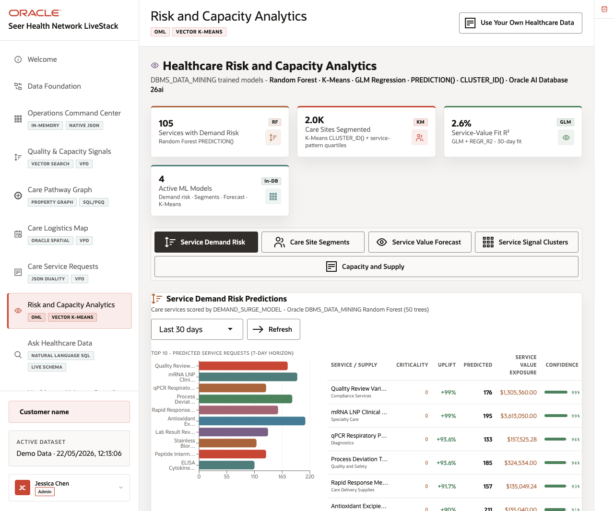
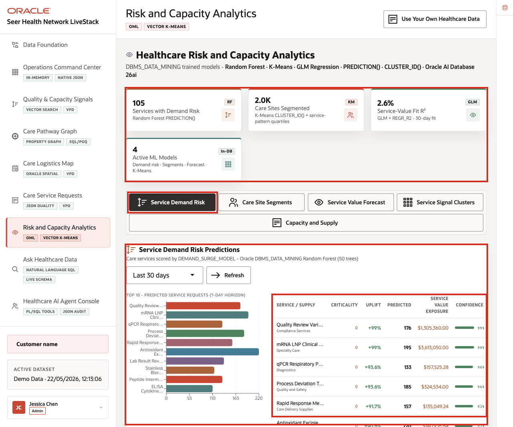
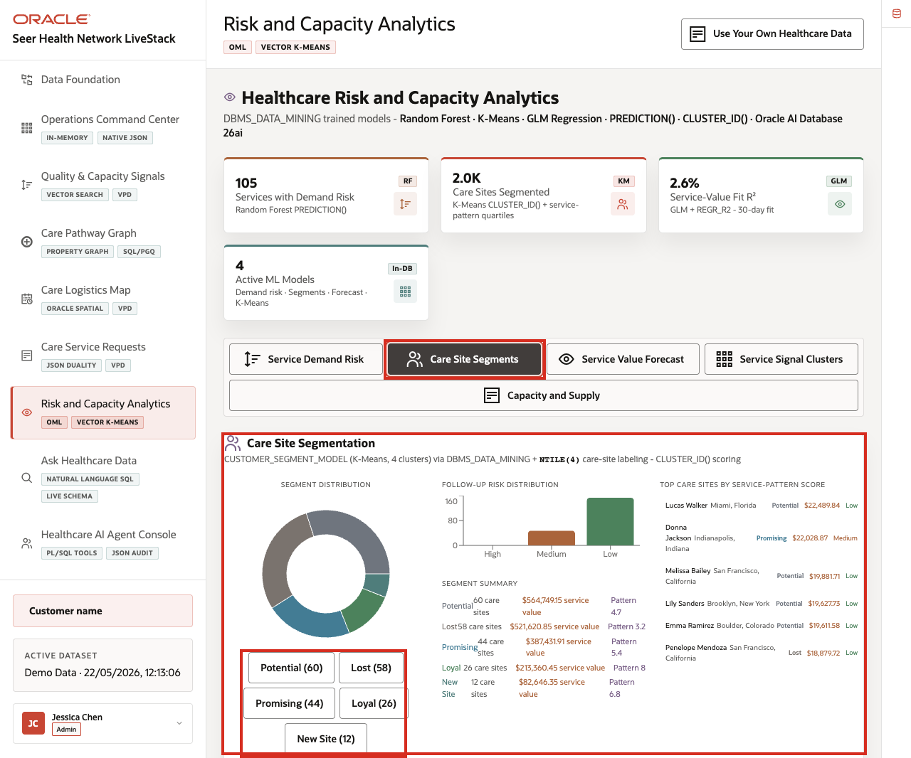
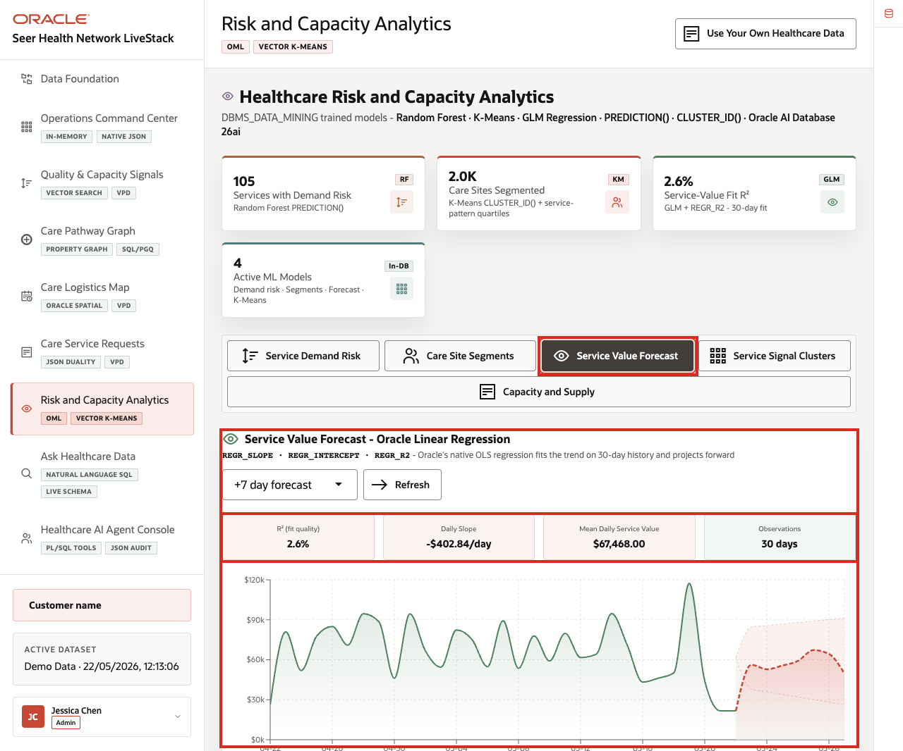
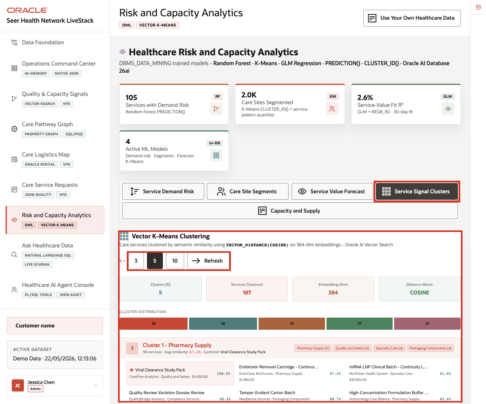
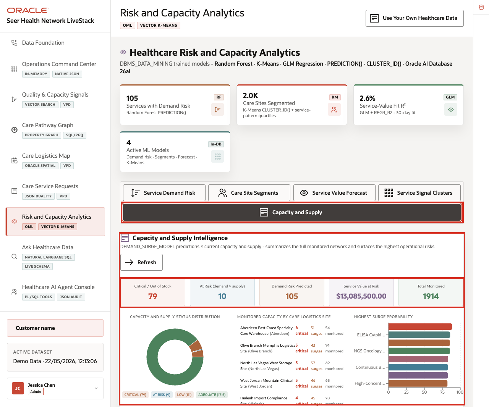

# Scene 8 Risk and Capacity Analytics

## Introduction

A healthcare analytics manager, capacity planner, quality improvement lead, or data science stakeholder uses this page to understand which predictive signals should drive action. This persona needs to know which care services have demand risk, how care sites segment by operating pattern, whether service value is trending, which services cluster semantically, and where capacity or supply risk needs attention.

This is difficult when predictive work is split across notebooks, exported CSV files, BI extracts, external ML services, and separate operational systems. Healthcare teams can lose trust in predictions when model features are stale, scoring jobs run away from live data, or the explanation behind a forecast is disconnected from the service request and capacity records that business users rely on.

Oracle AI Database helps address these challenges by keeping machine learning close to governed healthcare data. Oracle Machine Learning models and SQL analytics can run from the same connected data foundation that powers the rest of the LiveStack Demo.

Estimated Time: 12 minutes

### Objectives

In this scene, you will:
- Review the **Risk and Capacity Analytics** workspace, KPI cards, and five analytics tabs.
- Inspect **Service Demand Risk** predictions.
- Review **Care Site Segments**.
- Interpret the **Service Value Forecast**.
- Explore **Service Signal Clusters**.
- Review **Capacity and Supply** intelligence and risk indicators.

## Task 1: Inspect Service Demand Risk

1. Click **Risk and Capacity Analytics** in the sidebar.
2. Review the four KPI cards at the top of the page: **Services with Demand Risk**, **Care Sites Segmented**, **Service-Value Fit R²**, and **Active ML Models**.
3. Review the five analytics tabs: **Service Demand Risk**, **Care Site Segments**, **Service Value Forecast**, **Service Signal Clusters**, and **Capacity and Supply**.
4. Confirm that **Service Demand Risk** is selected.
5. Review the scoring window, **Refresh** control, bar chart, and prediction table.

    

In the current demo dataset, the page shows **105** services with demand risk, **2.0K** care sites segmented, a **2.6%** service-value fit R-squared, and **4** active ML models. Use this opening view to set the scene: this page is not a separate data science notebook. It is a business-facing analytics surface backed by in-database analytics.

In the prediction table, focus on rows such as **Quality Review Variation Dossier Review**, **mRNA LNP Clinical Batch - Continuity Lot 2**, **qPCR Respiratory Panel - Continuity Lot 2**, and **Process Deviation Triage Service - Continuity Lot 2**. **Quality Review Variation Dossier Review** shows about **176** predicted service requests, about **$1.31M** in value exposure, and **99%** confidence. **mRNA LNP Clinical Batch - Continuity Lot 2** shows about **195** predicted service requests, about **$3.61M** in value exposure, and **99%** confidence. These are the data points to emphasize: the table turns model output into operational questions about capacity, supply, and quality response.

## Task 2: Review Care Site Segments

1. Click **Care Site Segments**.
2. Review the **Segment Distribution** donut chart.
3. Review the **Follow-up Risk Distribution** bar chart.
4. Review **Segment Summary** and **Top care sites by service-pattern score**.
5. Optionally click a segment such as **Potential (60)**, **Lost (58)**, **Promising (44)**, **Loyal (26)**, or **New Site (12)** to focus the site list.

    

In the current demo dataset, the segment distribution includes **Potential (60)**, **Lost (58)**, **Promising (44)**, **Loyal (26)**, and **New Site (12)**. The segment summary also shows service value and pattern score for each group. This is useful for care operations teams because segmentation becomes operational: the team can move from a model result to the care sites that need follow-up, service coordination, or capacity planning.

## Task 3: Interpret Service Value Forecast

1. Click **Service Value Forecast**.
2. Review the forecast horizon selector and **Refresh** control.
3. Review the model quality cards: **R² (fit quality)**, **Daily Slope**, **Mean Daily Service Value**, and **Observations**.
4. Review the service value trend chart and forecast band.

    

In the current demo dataset, the 7-day forecast view shows **2.6%** R², a daily slope of about **-$402.84/day**, mean daily service value of about **$67,468.00**, and **30 days** of observations. The low R² is an important demo talking point: the page does not hide model quality. It shows when a trend is weak, so a planner can treat the forecast as directional context instead of over-trusting it.

## Task 4: Explore Service Signal Clusters

1. Click **Service Signal Clusters**.
2. Review the **K =** controls.
3. Review the cluster count, services clustered, embedding dimensions, and distance metric.
4. Review a cluster card and its related services.

    

In the current demo dataset, the vector clustering view shows **187** services clustered with **384** embedding dimensions and **COSINE** distance. With **K = 5**, visible clusters include **Pharmacy Supply**, **Specialty Care**, and **Quality and Safety** groupings. **Cluster 1 - Pharmacy Supply** contains **38** services with **67.2%** average similarity and **Viral Clearance Study Pack** as the centroid. This helps users understand how vector similarity can group healthcare services and supplies without leaving the governed data platform.

## Task 5: Review Capacity and Supply

1. Click **Capacity and Supply**.
2. Review the summary cards.
3. Review the capacity and supply status distribution.
4. Review monitored capacity by care logistics site.
5. Scan the highest surge probability chart for services or supplies that need attention.

    

In the current demo dataset, the tab shows **79** critical or out-of-stock items, **10** at-risk items where demand exceeds supply, **105** demand-risk predictions, about **$13.09M** service value at risk, and **1,914** monitored records. The status distribution also separates monitored supply into **Critical (79)**, **At Risk (9)**, **Low (111)**, and **Adequate (1,715)**. This turns model output into an operating view: the user can see which sites and services need attention before a capacity issue affects care operations.

You can move to the next scene.

## Credits & Build Notes
- **Author** - Oracle LiveLabs Team
- **Last Updated By/Date** - Oracle LiveLabs Team, 2026-05-22
