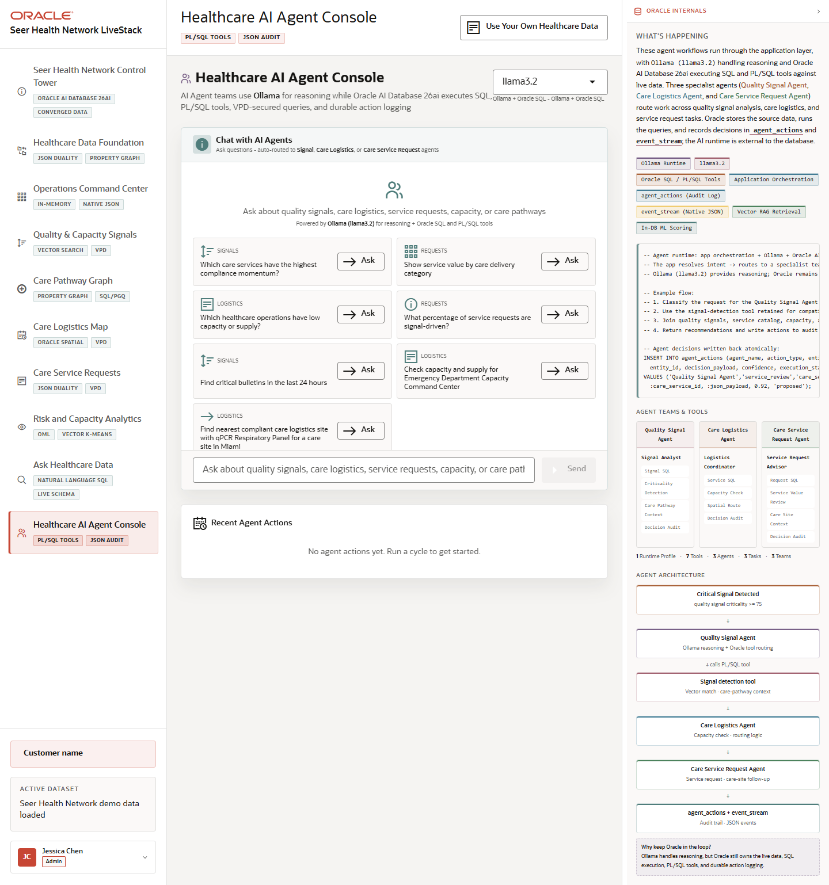

# Scene 9 Healthcare AI Agent Console

## Introduction

The Healthcare AI Agent Console shows agent-assisted operations. Specialist agents route work across quality signals, care logistics, and service request follow-up while Oracle records actions and executes SQL or PL/SQL tools.

Estimated Time: 10 minutes

### Objectives

In this lab, you will:
- Open the AI agent console.
- Ask an agent runtime question.
- Review recent agent actions and the audit-oriented evidence panel.

## Task 1: Review the agent teams

1. Click **Healthcare AI Agent Console** in the left navigation.
2. Review the agent team descriptions for the Quality Signal Agent, Care Logistics Agent, and Care Service Request Agent.
3. Inspect the runtime profile selector.

Expected result:
- The page shows a multi-agent workflow rather than a single generic chatbot.
- The right panel explains how agent routing, SQL tools, PL/SQL tools, VPD-secured queries, and action logging fit together.

## Task 2: Ask an agent question

1. In the chat input, ask a question such as `Which quality signals should operations review first?`
2. Click **Ask**.
3. Review the response and any table, route, or recommendation data returned.

Expected result:
- The agent classifies the request, routes it to the appropriate specialist team, and returns a response when backend services are running.
- Recent actions update so the user can see the operational audit trail.

## Task 3: Why this matters?

Healthcare AI workflows need explainable routing, governed data access, and durable action history. This scene shows agents as operational helpers connected to Oracle-controlled evidence rather than unmanaged free-form automation.

## Credits & Build Notes
- **Author** - Oracle LiveStack Team
- **Last Updated By/Date** - Oracle LiveStack Team, 2026-05-13
