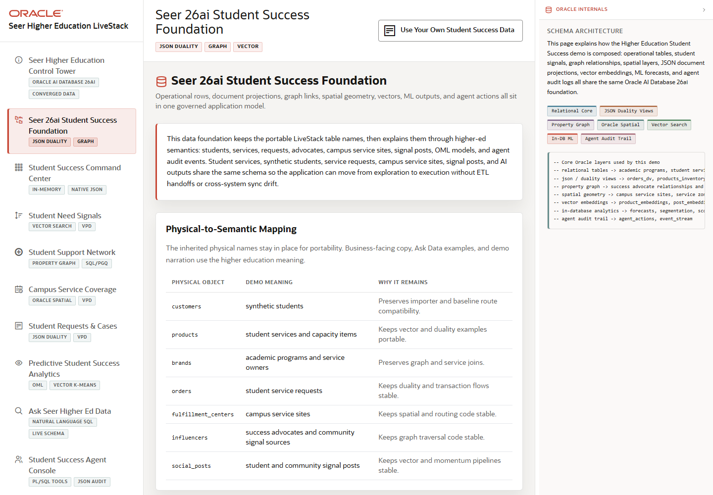

# Scene 1 Seer 26ai Student Success Foundation

## Introduction

This scene establishes the trusted data foundation for the demo. The page maps the higher education story to the Oracle objects that make the application work: relational core tables, JSON Duality Views, property graph relationships, spatial service coverage, vector search artifacts, in-database ML features, and agent audit tables.

Estimated Time: 8 minutes

### Objectives

In this lab, you will:
- Open the student-success foundation scene.
- Review the physical-to-semantic mapping from source tables to higher education views.
- Inspect the Oracle internals panel and use the quick route controls to preview downstream scenes.

## Task 1: Open the Foundation Scene

1. Open the running LiveStack application.
2. In the left navigation, click **Seer 26ai Student Success Foundation**.
3. Review the capability badges near the page title: **Relational Core**, **JSON Duality Views**, **Property Graph**, **Oracle Spatial**, **Vector Search**, **In-DB ML**, and **Agent Audit Trail**.

Expected result:
- The foundation page opens with the physical-to-semantic mapping and Oracle capability groups.
- The user can explain that the same Oracle schema supports the dashboard, graph, spatial map, analytics, natural-language questions, and agent workflows.

## Task 2: Review the Data Model Mapping

1. Review **Physical-to-Semantic Mapping**.
2. Compare source entities such as students, programs, services, service requests, advocates, signal posts, service routes, and capacity.
3. Inspect how the application translates baseline table names into higher education concepts without moving the governed data out of Oracle.

Expected result:
- The mapping makes the story credible before the demo moves into analytics.
- The audience sees that the application is a domain-specific student-success layer over a portable Oracle LiveStack schema.

## Task 3: Inspect Oracle Internals

1. Open or expand the **Oracle Internals** panel on the right side of the application.
2. Review the SQL and diagram content that explains how relational, JSON, graph, spatial, vector, OML, and audit data share one database foundation.
3. Use one of the quick route buttons on the foundation page, such as command center or Ask Data, to preview how the same foundation powers the next scene.

Expected result:
- The Oracle internals panel reinforces that the demo is not a set of disconnected services.
- The user can point to Oracle AI Database 26ai as the common data and execution layer.

## Task 4: Why this matters?

Student-success demos can become fragmented if dashboards, case workflows, AI search, graph analysis, and predictions each require separate platforms. This opening scene gives the customer a simple architectural claim: Seer Higher Education can serve all of these workflows from one governed Oracle data foundation, reducing duplication, sync lag, and inconsistent student context.

## Credits & Build Notes
- **Author** - Oracle LiveStack Team
- **Last Updated By/Date** - Oracle LiveStack Team, 2026-05-13

