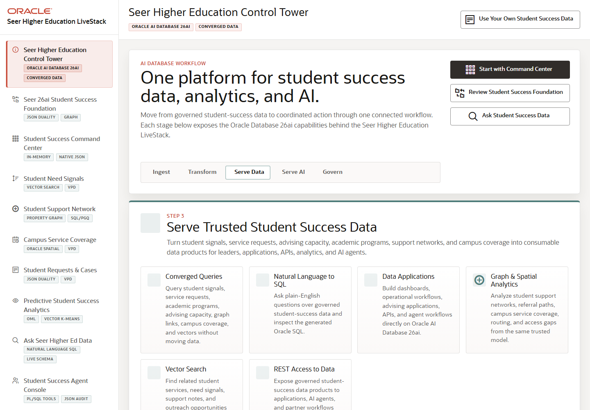

# Scene 10 Use Your Own Student Success Data

## Introduction

The top-bar dataset workflow lets a user download a student-success template, validate a completed ZIP, upload it into the demo, or restore the synthetic demo data. It turns the LiveStack from a static demo into a reusable proof environment.

Estimated Time: 8 minutes

### Objectives

In this lab, you will:
- Locate the **Use Your Own Student Success Data** control.
- Open the dataset manager workflow.
- Review the validation and restore paths.

## Task 1: Open the Dataset Workflow

1. From any page, locate the top-bar button labeled **Use Your Own Student Success Data**.
2. Click the button to open the dataset manager overlay.
3. Review the three workflow sections: download template, select completed dataset ZIP, and validate or restore demo data.

Expected result:
- The overlay opens as a guided dataset manager.
- The user sees the path for bringing a completed student-success dataset into the LiveStack.

## Task 2: Validate or Restore Data

1. Click **Download student success template** when preparing a new dataset.
2. Select a completed dataset ZIP when available.
3. Click **Validate** before upload to review errors and warnings.
4. Use **Restore Demo Data** when you want to return the application to the synthetic baseline.

Expected result:
- Validation provides feedback before data is loaded.
- Restore returns the LiveStack to the known demo state when a replay needs to start fresh.

## Task 3: Connect the Workflow to the Demo Story

1. Explain that the import route is optional for a first walkthrough.
2. Use the active dataset label in the sidebar to confirm which dataset is driving the app.
3. After changing data, return to the command center and review how the scenes reflect the active dataset.

Expected result:
- The user can tell whether the demo is running synthetic data or an imported dataset.
- The workflow gives the customer a practical next step after the guided demo.

## Task 4: Why this matters?

Customers need to see how a LiveStack can move from canned story to proof environment. This scene shows the import, validation, and restore controls that make the higher education demo reusable while preserving a clean baseline.

## Credits & Build Notes
- **Author** - Oracle LiveStack Team
- **Last Updated By/Date** - Oracle LiveStack Team, 2026-05-13

