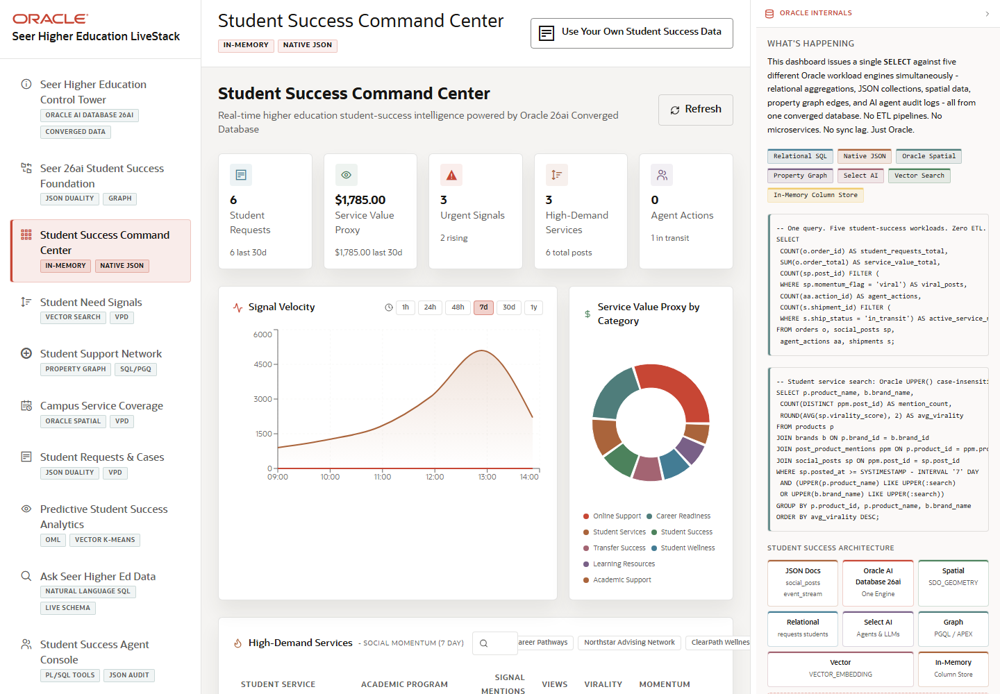

# Scene 2 Student Success Command Center

## Introduction

The command center is the executive operating view. It brings together student requests, service value proxy, urgent signals, high-demand services, and agent actions so leaders can see where attention is needed before drilling into a specific workflow.

Estimated Time: 10 minutes

### Objectives

In this lab, you will:
- Open the command center from the left navigation or welcome action.
- Review the top KPI cards and live trend panels.
- Select a high-demand service to inspect the detail panel and Oracle evidence.

## Task 1: Open the Command Center

1. Click **Student Success Command Center** in the left navigation.
2. Review the KPI cards: **Student Requests**, **Service Value Proxy**, **Urgent Signals**, **High-Demand Services**, and **Agent Actions**.
3. Click the refresh control if you want to reload the dashboard summary.

Expected result:
- The dashboard summarizes student-success operations in a single view.
- The audience sees demand, urgency, service activity, and agent activity side by side.

## Task 2: Investigate Service Demand

1. Review the trend and category panels below the KPI row.
2. Use the search box to filter student services or programs.
3. Select one row in the high-demand services table.
4. In the detail panel, switch between the business detail and JSON views when available.

Expected result:
- The selected service expands into a focused explanation of demand, program, category, service value, and supporting JSON data.
- The user can compare operational metrics with the document-shaped view exposed by Oracle.

## Task 3: Connect the Dashboard to Oracle

1. Open the **Oracle Internals** panel.
2. Review the feature badges for relational SQL, native JSON, Oracle Spatial, property graph, Select AI-style data access, vector search, and In-Memory Column Store.
3. Explain that the dashboard pulls multiple workload types without staging them in separate systems.

Expected result:
- The audience understands that one Oracle query layer can feed the command center, not a collection of separate pipelines.
- The command center becomes the launch point for the remaining scenes.

## Task 4: Why this matters?

Higher education leaders need a compressed view of demand, capacity, risk, and action. This scene shows how Oracle can serve a student-success control tower that is broad enough for executives but still drillable for operators who need the evidence behind a signal.

## Credits & Build Notes
- **Author** - Oracle LiveStack Team
- **Last Updated By/Date** - Oracle LiveStack Team, 2026-05-13

