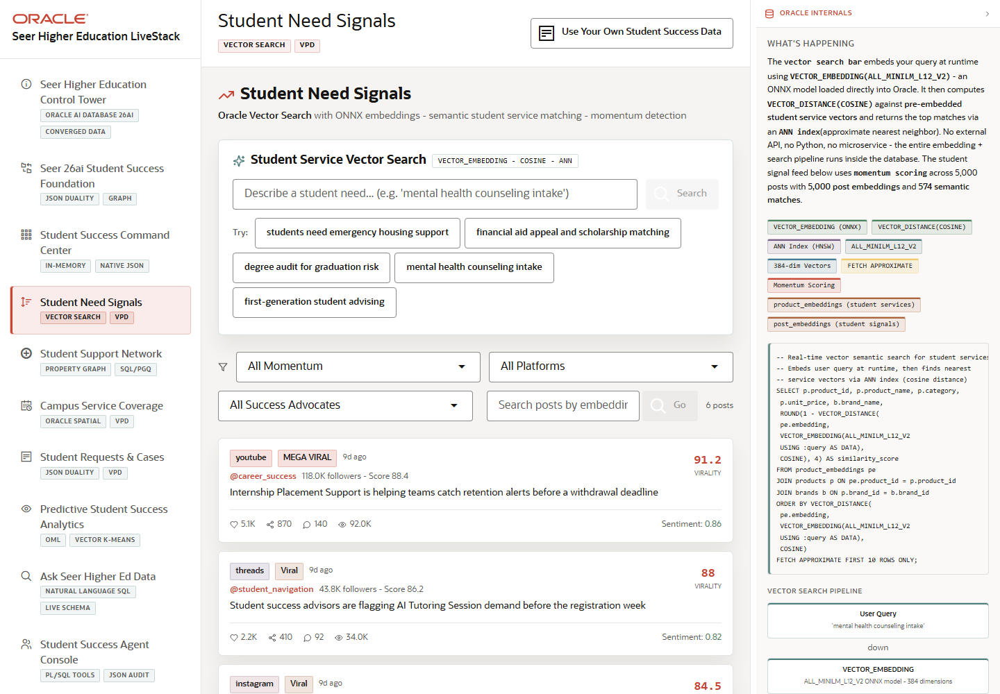

# Scene 3 Student Need Signals

## Introduction

This scene shows how student and community signals become searchable student-service demand indicators. The page combines signal posts, momentum filters, advocate filters, and Oracle vector search so the user can find related student services from plain language.

Estimated Time: 10 minutes

### Objectives

In this lab, you will:
- Open the student need signals scene.
- Run a semantic student-service search.
- Filter signal posts by momentum, platform, and success advocate.

## Task 1: Open Student Need Signals

1. Click **Student Need Signals** in the left navigation.
2. Review the page header and the **Student Service Vector Search** panel.
3. Notice the example prompts, including student needs such as mental health counseling intake.

Expected result:
- The page shows signal posts and semantic search controls.
- The user can describe the page as a signal-to-service discovery workflow.

## Task 2: Search for a Student Need

1. In the vector search input, type a student need such as `mental health counseling intake`.
2. Click **Search**.
3. Review the ranked service matches and similarity scores.
4. Click **Clear** to reset the search before continuing.

Expected result:
- The application returns student services that are semantically related to the need, not just keyword matches.
- The result supports a business discussion about matching emerging needs with available campus services.

## Task 3: Filter Signal Posts

1. Use **All Momentum** to narrow posts to rising or viral signals.
2. Use **All Platforms** and **All Success Advocates** to compare channels and advocates.
3. Type into the post search box and click **Go** to search posts by embedding.

Expected result:
- Filters change the post list and highlight the signals worth routing to student-success teams.
- The Oracle internals panel explains `VECTOR_EMBEDDING`, `VECTOR_DISTANCE(COSINE)`, ANN indexing, and VPD filtering.

## Task 4: Why this matters?

Student needs often appear first as unstructured signals. This scene shows how Oracle vector search can turn those signals into actionable service matches while row-level security and governed data remain inside the database.

## Credits & Build Notes
- **Author** - Oracle LiveStack Team
- **Last Updated By/Date** - Oracle LiveStack Team, 2026-05-13

