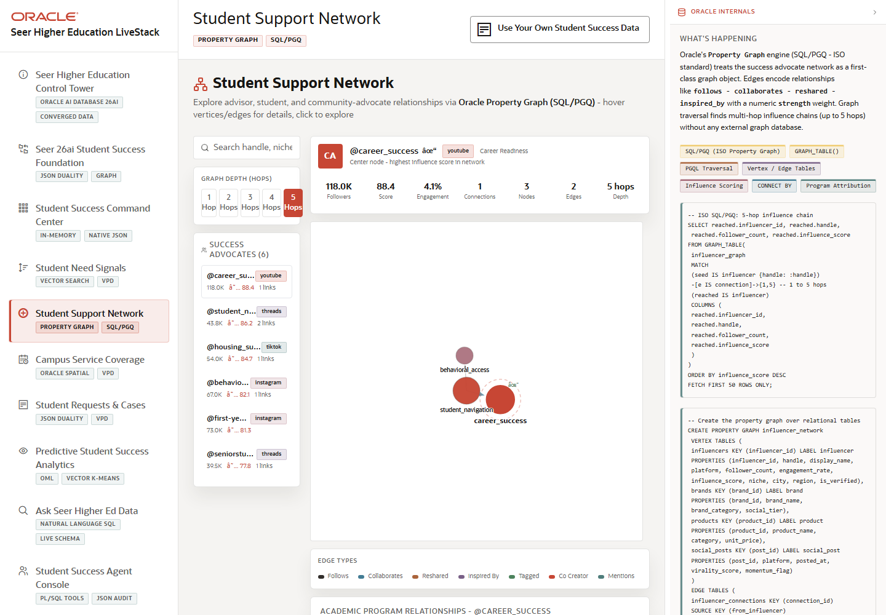

# Scene 4 Student Support Network

## Introduction

The support network scene turns advocates, community voices, influence relationships, and service mentions into a navigable graph. It helps the user identify who is amplifying a student-success issue and which network paths connect signals to programs and services.

Estimated Time: 10 minutes

### Objectives

In this lab, you will:
- Open the student support network scene.
- Select an advocate and inspect the graph.
- Run graph query examples and connect them to Oracle property graph capabilities.

## Task 1: Open the Support Network

1. Click **Student Support Network** in the left navigation.
2. Review the advocate list and search field.
3. Select an advocate from the list or use the search box to find a handle, niche, or support area.

Expected result:
- The page displays a graph centered on the selected advocate.
- The user can inspect connected advocates, signal relationships, and service/program mentions.

## Task 2: Explore the Graph

1. Change the graph depth when available to expand or focus the network.
2. Click nodes in the graph to inspect details.
3. Review the query explorer cards and select a graph query example.
4. Run an example query after reviewing its parameters.

Expected result:
- The graph visualization changes as the user changes selection, depth, or example query.
- The result demonstrates relationship traversal rather than only tabular filtering.

## Task 3: Review Oracle Graph Evidence

1. Open the **Oracle Internals** panel.
2. Review the feature badges for **SQL/PGQ**, **GRAPH_TABLE()**, **PGQL Traversal**, vertex and edge tables, and VPD.
3. Connect the visible graph to the schema objects `influencers`, `influencer_connections`, `brand_influencer_links`, and `post_product_mentions`.

Expected result:
- The audience sees how Oracle property graph can model the human network around student-success signals.
- VPD is visible as a governance control for graph and social data.

## Task 4: Why this matters?

When a student-success issue starts spreading through communities, the institution needs to know the network path, not just the count of posts. This scene shows how Oracle graph analysis helps identify influence, propagation, and intervention points.

## Credits & Build Notes
- **Author** - Oracle LiveStack Team
- **Last Updated By/Date** - Oracle LiveStack Team, 2026-05-13

