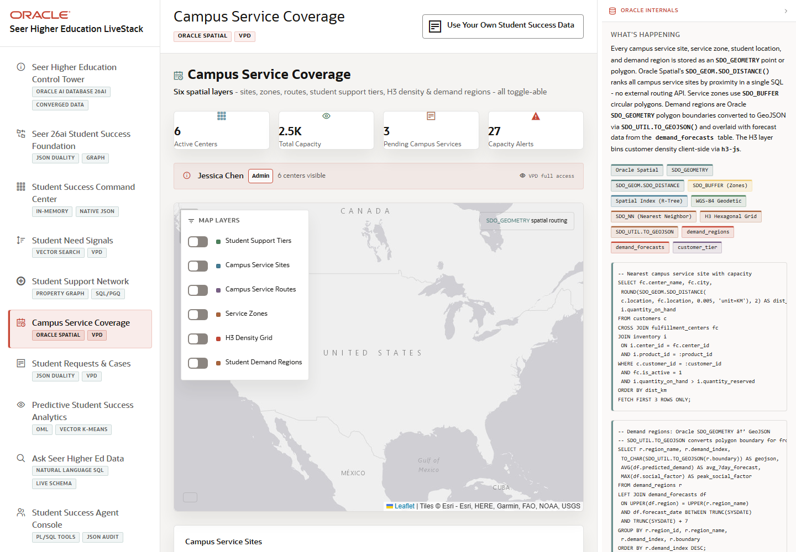

# Scene 5 Campus Service Coverage

## Introduction

This scene uses a map to show where student-service centers, demand regions, zones, students, and routes overlap. It demonstrates how Oracle Spatial can support decisions about coverage gaps, nearest service locations, capacity pressure, and routing.

Estimated Time: 10 minutes

### Objectives

In this lab, you will:
- Open the campus service coverage scene.
- Toggle spatial layers and inspect the map.
- Connect the map to Oracle Spatial functions and VPD controls.

## Task 1: Open Campus Service Coverage

1. Click **Campus Service Coverage** in the left navigation.
2. Review the map, legend, and layer controls.
3. Identify campus service sites, demand regions, service zones, student locations, and active routes.

Expected result:
- The map opens with spatial layers representing service access and demand.
- The user can explain the coverage story without leaving the application.

## Task 2: Toggle and Compare Layers

1. Turn layers on and off to isolate service sites, demand regions, zones, or student locations.
2. Review the summary cards and alert panels next to the map.
3. Select a route or service center when available to inspect the route or capacity detail.

Expected result:
- The visible map changes as layers are toggled.
- The audience can compare where students are, where services are available, and where capacity pressure exists.

## Task 3: Inspect Spatial Internals

1. Open the **Oracle Internals** panel.
2. Review feature badges for **SDO_GEOMETRY**, **SDO_GEOM.SDO_DISTANCE**, **SDO_BUFFER**, spatial indexes, nearest-neighbor search, and H3-style density.
3. Explain that the map uses database-side spatial operations instead of a separate GIS data store.

Expected result:
- The user can connect map behavior to Oracle Spatial objects such as service points, zone polygons, demand regions, and distance calculations.
- Governance remains transparent through VPD policy references.

## Task 4: Why this matters?

Student support is local. A service that looks available in aggregate may be inaccessible for a specific campus, neighborhood, or risk tier. This scene shows how Oracle Spatial helps turn student demand into location-aware service decisions.

## Credits & Build Notes
- **Author** - Oracle LiveStack Team
- **Last Updated By/Date** - Oracle LiveStack Team, 2026-05-13

