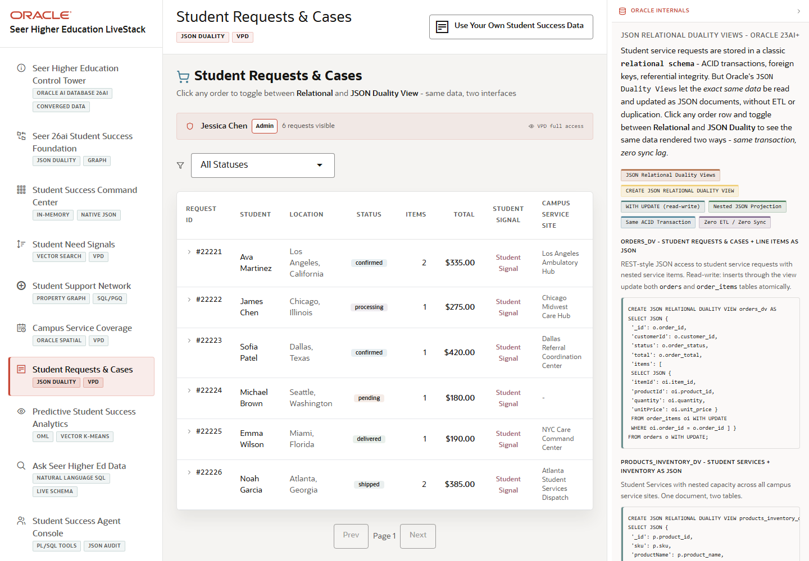

# Scene 6 Student Requests and Cases

## Introduction

This scene shows student requests as both operational cases and JSON documents. The user can inspect request status, service lines, route context, and JSON Relational Duality Views while staying in the student-success workflow.

Estimated Time: 10 minutes

### Objectives

In this lab, you will:
- Open the student requests and cases scene.
- Filter and page through student requests.
- Inspect a request document and compare the normalized and JSON views.

## Task 1: Open Student Requests and Cases

1. Click **Student Requests & Cases** in the left navigation.
2. Review the request list, status filter, pagination controls, and route display.
3. Use **All Statuses** to narrow the list to a specific request state.

Expected result:
- The request list updates based on the status filter.
- The user can describe each row as a student service case backed by Oracle data.

## Task 2: Inspect a Request Document

1. Click a request to open the detail panel.
2. Review the request status, service items, and route information.
3. Use the detail tabs to compare the operational detail with the JSON document.
4. Click **Copy request document** if you want to use the JSON as demo evidence.

Expected result:
- The request panel shows both case context and document-shaped data.
- The user can explain that Oracle JSON Relational Duality Views expose the same governed data as JSON without a separate document database.

## Task 3: Review Route and Security Evidence

1. Toggle between **Driving Route** and **Arc Only** when route controls are available.
2. Open the **Oracle Internals** panel.
3. Review the badges for JSON Relational Duality Views, read-write duality, same ACID transaction, and VPD row-level security.

Expected result:
- Route context and JSON context remain part of the same request workflow.
- The guide user can connect case visibility to VPD and student-region policy controls.

## Task 4: Why this matters?

Case management often splits operational records, JSON payloads, and map context across different systems. This scene shows a cleaner pattern: Oracle stores the governed request data once and serves it to the UI as relational rows, JSON documents, and spatial route context.

## Credits & Build Notes
- **Author** - Oracle LiveStack Team
- **Last Updated By/Date** - Oracle LiveStack Team, 2026-05-13

