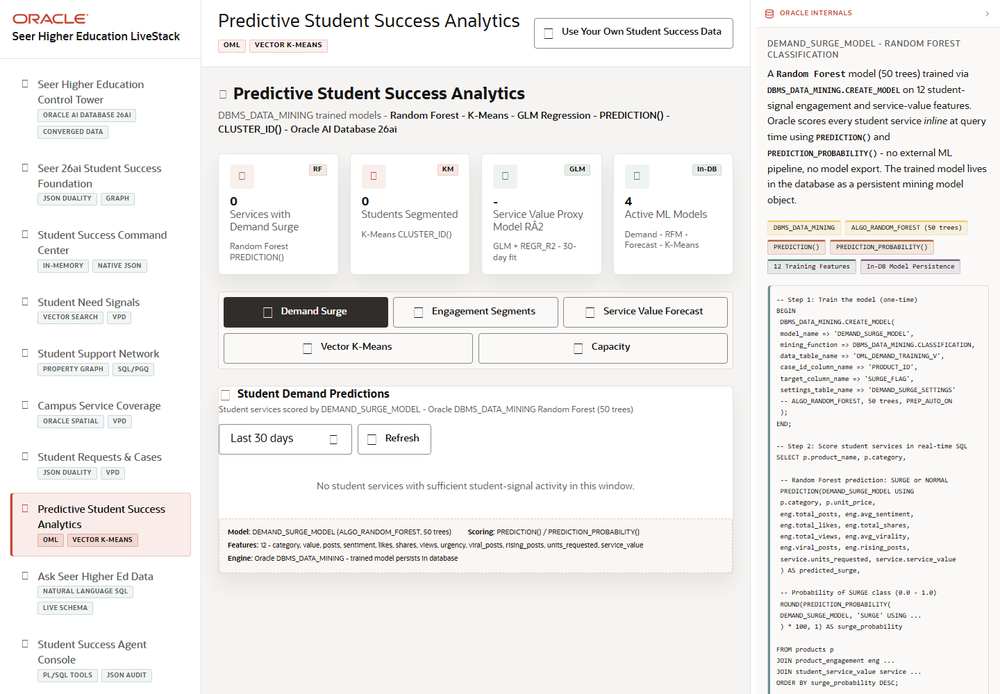

# Scene 7 Predictive Student Success Analytics

## Introduction

This scene demonstrates predictive analytics inside the student-success workflow. It combines demand surge scoring, synthetic student segmentation, service value forecasting, vector clustering, and capacity risk intelligence in one analytics surface.

Estimated Time: 12 minutes

### Objectives

In this lab, you will:
- Open predictive student success analytics.
- Move across the analytics tabs.
- Refresh scoring, fit forecasts, cluster services, and inspect capacity risk.

## Task 1: Open Predictive Analytics

1. Click **Predictive Student Success Analytics** in the left navigation.
2. Review the top analytics cards for demand surge, student segments, model fit, and active models.
3. Notice the tab bar for demand, segmentation, forecast, clustering, and capacity views.

Expected result:
- The page presents several predictive workflows without leaving the app.
- The user can frame this as Oracle Machine Learning and SQL analytics in the student-success context.

## Task 2: Operate the Analytics Tabs

1. In the demand view, click **Refresh** to rescore services with demand surge logic.
2. Open the segmentation tab and select a segment chip to filter synthetic students.
3. Open the forecast tab, choose a forecast window, and click **Refresh** or **Fitting** when available.
4. Open the clustering tab, choose a `k` value, and click **Refresh**.
5. Open the capacity view and review services with risk or limited days of capacity.

Expected result:
- Each tab changes the analytics view and gives the user a different decision lens.
- Oracle ML, SQL windows, vector clustering, and capacity scoring become visible in business terms.

## Task 3: Review Model Evidence

1. Open the **Oracle Internals** panel while moving across tabs.
2. Review badges such as **DBMS_DATA_MINING**, **ALGO_RANDOM_FOREST**, **ALGO_KMEANS**, **PREDICTION()**, **CLUSTER_ID()**, **REGR_SLOPE**, and **PREDICTION_PROBABILITY()**.
3. Explain that models and scoring remain close to governed Oracle data.

Expected result:
- The audience sees analytics as part of the operational database flow, not a separate export.
- The result supports decisions about which services need attention, which students or services cluster together, and where capacity is at risk.

## Task 4: Why this matters?

Predictive student success is useful only when it is close to action. This scene shows how Oracle can score demand, forecast value, segment students, and flag capacity risk where the operational data already lives.

## Credits & Build Notes
- **Author** - Oracle LiveStack Team
- **Last Updated By/Date** - Oracle LiveStack Team, 2026-05-13

