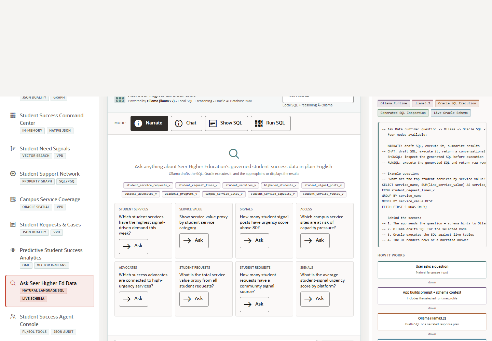

# Scene 8 Ask Seer Higher Ed Data

## Introduction

This scene lets a user ask questions over governed student-success data in natural language. Ollama drafts the response or SQL, and Oracle executes the SQL against the live schema so results stay grounded in database evidence.

Estimated Time: 10 minutes

### Objectives

In this lab, you will:
- Open the Ask Data scene.
- Select a runtime profile and question mode.
- Ask a question, inspect SQL, and review returned rows or narration.

## Task 1: Open Ask Data

1. Click **Ask Seer Higher Ed Data** in the left navigation.
2. Review the runtime profile selector and profile metadata.
3. Review the mode buttons, such as narrated answer, chat, show SQL, and run SQL.

Expected result:
- The page is ready for a governed natural-language data question.
- The user sees that model choice and execution mode are explicit controls.

## Task 2: Ask a Student-Success Question

1. Type a question such as `Which student services have the highest urgent signal volume?`.
2. Select **Show SQL** if you want to inspect the generated query before running it.
3. Select **Run SQL** when you want Oracle to execute the generated query.
4. Click **Send** and review the answer, generated SQL, and result table or narration.

Expected result:
- The app returns a grounded answer, generated SQL, or rows from Oracle depending on the selected mode.
- The user can inspect the query path instead of treating the answer as a black box.

## Task 3: Review Oracle Execution

1. Open the **Oracle Internals** panel.
2. Review the flow from user question to prompt context, model draft, Oracle SQL execution, and UI answer.
3. Use **Clear** before asking a second question to keep the walkthrough focused.

Expected result:
- The audience understands that the language model assists the query workflow while Oracle remains the system of record.
- Generated SQL inspection gives a practical governance story.

## Task 4: Why this matters?

Campus users often know the question before they know the schema. This scene shows how natural-language access can lower the barrier to governed Oracle data while still preserving SQL visibility and database execution.

## Credits & Build Notes
- **Author** - Oracle LiveStack Team
- **Last Updated By/Date** - Oracle LiveStack Team, 2026-05-13

