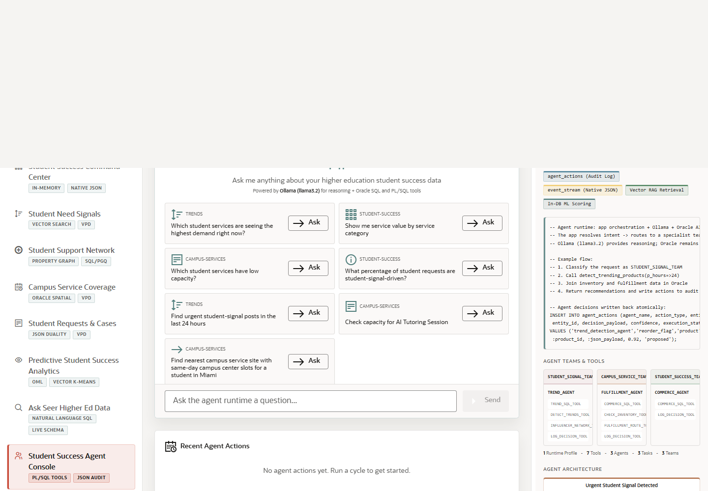

# Scene 9 Student Success Agent Console

## Introduction

The agent console shows agent-assisted student-success operations. The UI combines a chat interface, runtime profile selection, example questions, team history, tool execution, and an audit trail backed by Oracle tables.

Estimated Time: 10 minutes

### Objectives

In this lab, you will:
- Open the student success agent console.
- Ask an agent question or use an example prompt.
- Inspect logged actions and Oracle-backed tool execution.

## Task 1: Open the Agent Console

1. Click **Student Success Agent Console** in the left navigation.
2. Review the active runtime profile and the chat panel.
3. Review the example questions and choose one aligned to signals, capacity, or student-success operations.

Expected result:
- The console shows the agent runtime controls and chat interface.
- The audience sees that agent behavior is attached to a visible operational workflow.

## Task 2: Run an Agent Interaction

1. Click an example **Ask** button or type a question into the chat field.
2. Click **Send**.
3. Review the answer, tool calls, route or service details, and logged action summaries.
4. Click **Clear** before moving to a new scenario.

Expected result:
- The agent responds with reasoning grounded in Oracle data and application tools.
- The user can connect agent output to a decision, action, or audit record.

## Task 3: Inspect Agent Architecture

1. Open the **Oracle Internals** panel.
2. Review the flow from urgent signal detection to specialist teams, PL/SQL tools, vector retrieval, in-database scoring, and `agent_actions` audit logging.
3. Point out that Ollama handles reasoning, while Oracle owns the data, SQL execution, PL/SQL tools, and durable action log.

Expected result:
- The audience sees a practical division of labor between model reasoning and governed database execution.
- The scene provides a concrete AI agent story that a customer can replay.

## Task 4: Why this matters?

Agents are only credible in operations when their actions are explainable and auditable. This scene shows how a student-success agent can reason over live context while Oracle provides the durable execution layer and audit trail.

## Credits & Build Notes
- **Author** - Oracle LiveStack Team
- **Last Updated By/Date** - Oracle LiveStack Team, 2026-05-13

