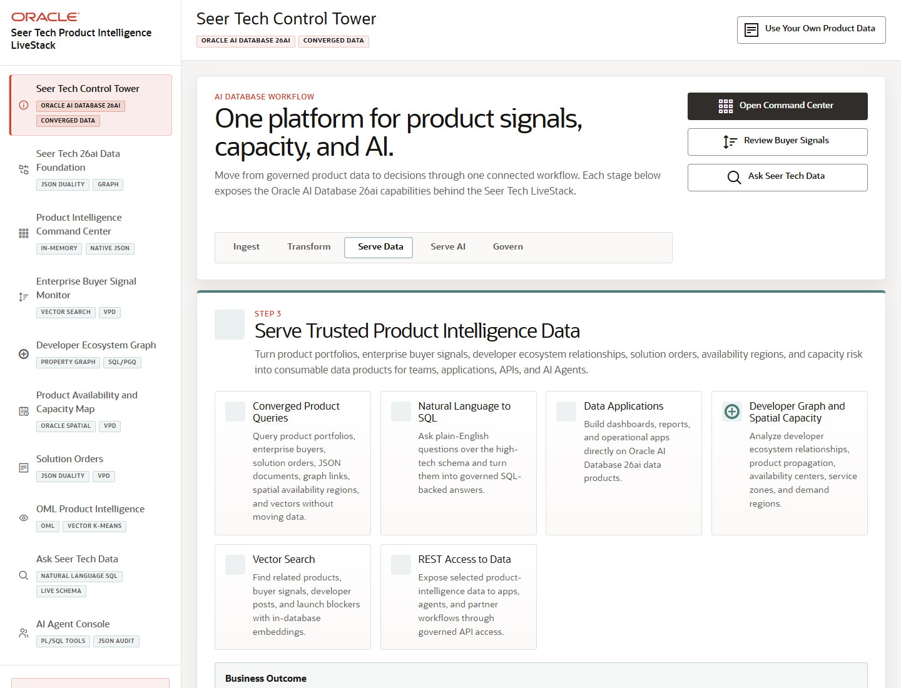

# Scene 1 Seer Tech Control Tower

## Introduction

This opening scene frames the Seer Tech Product Intelligence LiveStack as one connected workflow for product signals, capacity risk, governed data products, and AI-assisted operations.

Estimated Time: 8 minutes

### Objectives

In this lab, you will:
- Orient the presenter and audience to the Oracle AI Database 26ai workflow stages.
- Use the welcome quick actions to move into the main operator paths.
- Establish the business outcome before drilling into the data foundation and application scenes.

## Task 1: Open the Control Tower

1. Open the running LiveStack at `http://localhost:8505`.
2. Review the left navigation and confirm the active page is **Seer Tech Control Tower**.
3. Inspect the workflow stage track: Ingest, Transform, Serve Data, Serve AI, and Govern.

Expected result:
- The page introduces a single platform story for product signals, capacity, and AI.
- The stage track highlights **Serve Data**, setting up the rest of the demo as governed data delivered through apps, APIs, analytics, and agents.

## Task 2: Use the Quick Actions

1. Click **Open Command Center** to jump to the KPI dashboard, then return to the control tower from the left navigation.
2. Click **Review Buyer Signals** to preview the signal-monitoring workflow.
3. Click **Ask Seer Tech Data** to preview the natural-language data path.

Expected result:
- Each action changes the active application scene without leaving the LiveStack shell.
- The presenter can show that the same Oracle-backed product intelligence is reachable through dashboards, signal review, and AI question answering.

## Task 3: Why this matters?

The control tower gives the audience a simple mental model: Seer Tech is not looking at separate analytics, search, graph, spatial, and agent demos. The LiveStack shows one governed Oracle data foundation serving several operational experiences.

## Credits & Build Notes
- **Author** - Oracle LiveStack Team
- **Last Updated By/Date** - Oracle LiveStack Team, 2026-05-13
- **Source Bundle** - `livestack-hightech.zip`
