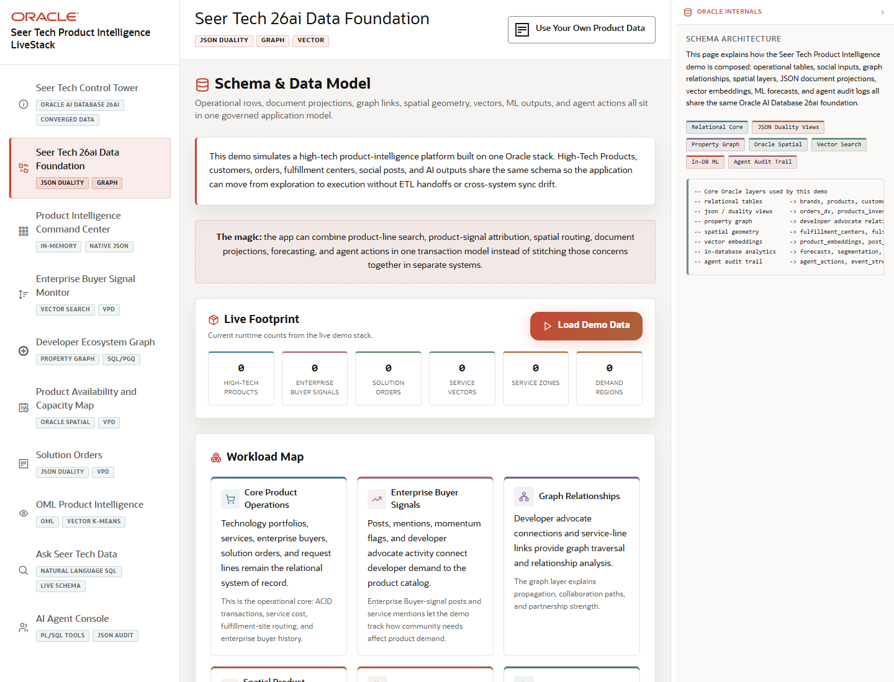

# Scene 2 Seer Tech 26ai Data Foundation

## Introduction

This scene explains the data model behind the app: relational product operations, JSON signals, graph relationships, spatial availability, vector search, machine learning, and agent audit trails in one Oracle Database-centered architecture.

Estimated Time: 8 minutes

### Objectives

In this lab, you will:
- Review the domain data groups and Oracle capabilities used by the LiveStack.
- Check the seeded demo data status and the refresh path.
- Use quick routes to connect the data foundation to the operator scenes.

## Task 1: Inspect the Data Foundation

1. Open **Seer Tech 26ai Data Foundation** from the left navigation.
2. Review the capability badges for Relational Core, JSON Duality Views, Property Graph, Oracle Spatial, Vector Search, In-DB ML, and Agent Audit Trail.
3. Inspect the data flow diagram and identify how product, buyer, order, spatial, vector, ML, and agent data are connected.

Expected result:
- The page explains the database as a converged foundation rather than a set of disconnected services.
- The presenter can point to the exact Oracle features that support the later operator workflows.

## Task 2: Verify or Refresh Demo Data

1. Review the demo data status cards for high-tech products, enterprise buyer signals, solution orders, service vectors, service zones, and demand regions.
2. Click **Refresh demo data** when the stack is connected to its database.
3. Use the **Quick Routes** buttons to move from the model to the dashboard, signal monitor, availability map, orders, OML analytics, or agent console.

Expected result:
- With the database running, counts confirm that the demo dataset is available.
- Quick routes make the model page a launchpad for the scenes that consume the same governed schema.

## Task 3: Why this matters?

The business story depends on trust. This scene shows that the app can use relational rows, JSON documents, graph edges, spatial geometries, vectors, and ML results without copying data into isolated systems.

## Credits & Build Notes
- **Author** - Oracle LiveStack Team
- **Last Updated By/Date** - Oracle LiveStack Team, 2026-05-13
- **Source Bundle** - `livestack-hightech.zip`
