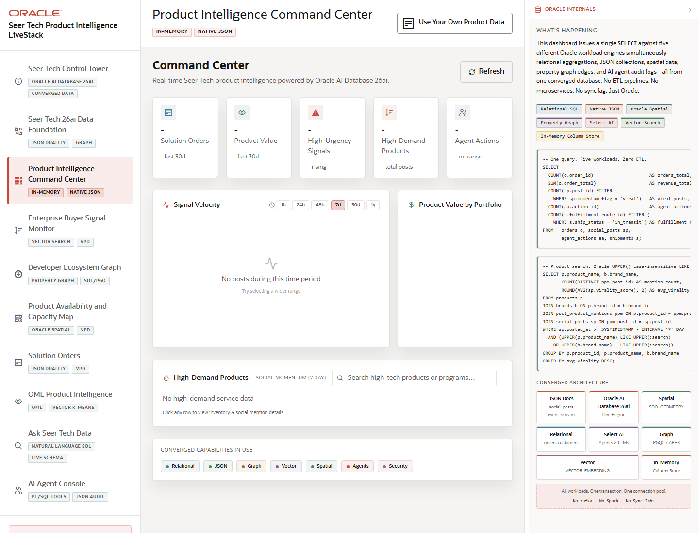

# Scene 3 Product Intelligence Command Center

## Introduction

The command center gives product and operations leaders a first read on solution orders, product value, high-urgency buyer signals, high-demand products, and recent agent activity.

Estimated Time: 8 minutes

### Objectives

In this lab, you will:
- Review executive KPIs and trend velocity in one operational dashboard.
- Filter high-demand products by time window, search term, and brand.
- Open a product detail modal to compare relational attributes with JSON duality evidence.

## Task 1: Review Product Intelligence KPIs

1. Open **Product Intelligence Command Center** from the left navigation.
2. Inspect KPI cards for Solution Orders, Product Value, High-Urgency Signals, High-Demand Products, and Agent Actions.
3. Review the signal velocity panel and switch between 1h, 24h, 48h, 7d, 30d, and 1y.

Expected result:
- The dashboard summarizes current demand, revenue, signal urgency, and operational activity.
- Changing the time window updates the social velocity context used for product-signal decisions.

## Task 2: Investigate High-Demand Products

1. Use the search field to narrow the trending product list.
2. Select a brand filter, then clear it to return to the complete list.
3. Click a product row to open its detail modal and switch between **Details** and **JSON**.

Expected result:
- The product list narrows to the selected signal or brand context.
- The detail modal shows the operator view and the JSON document projection side by side for the same product.

## Task 3: Why this matters?

The command center turns raw product and buyer activity into an executive triage surface. It shows which product lines need attention before the presenter moves into deeper signal, graph, spatial, ML, and agent workflows.

## Credits & Build Notes
- **Author** - Oracle LiveStack Team
- **Last Updated By/Date** - Oracle LiveStack Team, 2026-05-13
- **Source Bundle** - `livestack-hightech.zip`
