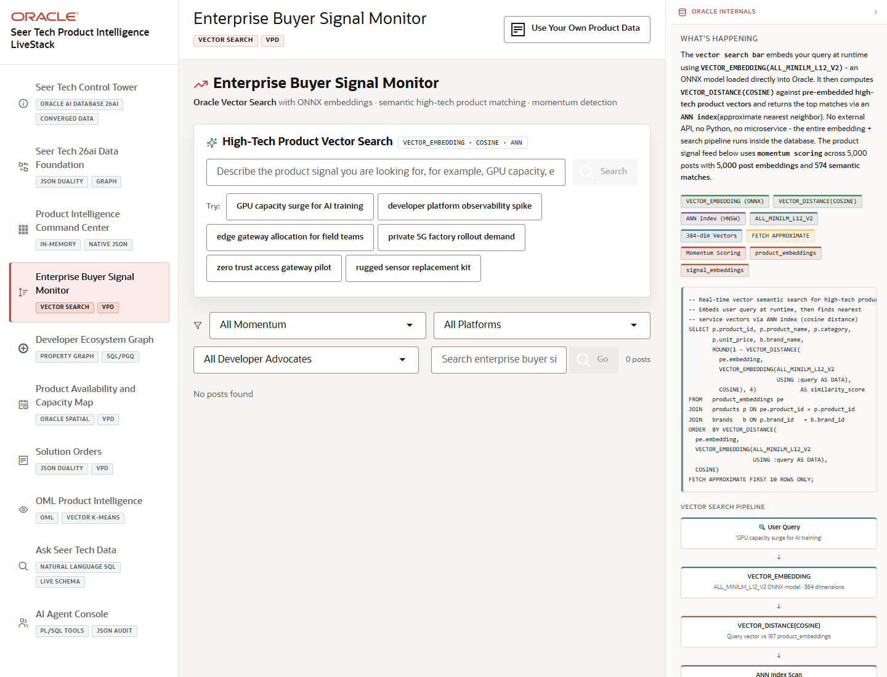

# Scene 4 Enterprise Buyer Signal Monitor

## Introduction

This scene demonstrates signal monitoring over synthetic buyer and developer activity, including vector search across product embeddings and signal embeddings.

Estimated Time: 8 minutes

### Objectives

In this lab, you will:
- Review buyer signal momentum and high-urgency posts.
- Use semantic search to find related products and launch blockers.
- Apply filters for momentum, platform, and developer advocate context.

## Task 1: Open the Signal Monitor

1. Open **Enterprise Buyer Signal Monitor** from the left navigation.
2. Review the Oracle internals panel for VECTOR_EMBEDDING, VECTOR_DISTANCE(COSINE), ANN index, ONNX model, and row-level security notes.
3. Inspect the signal feed, momentum summary, and product vector search panel.

Expected result:
- The page connects user-facing signal review to in-database vector search and governed access.
- The presenter can explain how urgent buyer signals are ranked and related to product lines.

## Task 2: Run a Product Vector Search

1. In **High-Tech Product Vector Search**, use one of the example searches or enter a product signal such as `edge AI launch blocker`.
2. Review returned products, similarity scores, technology portfolio notes, and signal context.
3. Apply a momentum or platform filter to compare how the feed changes.

Expected result:
- The search returns products related by semantic similarity, not simple keyword matching.
- Filters help the presenter narrow the signal story to the most relevant product or buyer channel.

## Task 3: Why this matters?

Signal monitoring helps Seer Tech move from noisy posts and buyer activity to ranked product opportunities and risks. Oracle vector search keeps that discovery close to governed operational data.

## Credits & Build Notes
- **Author** - Oracle LiveStack Team
- **Last Updated By/Date** - Oracle LiveStack Team, 2026-05-13
- **Source Bundle** - `livestack-hightech.zip`
