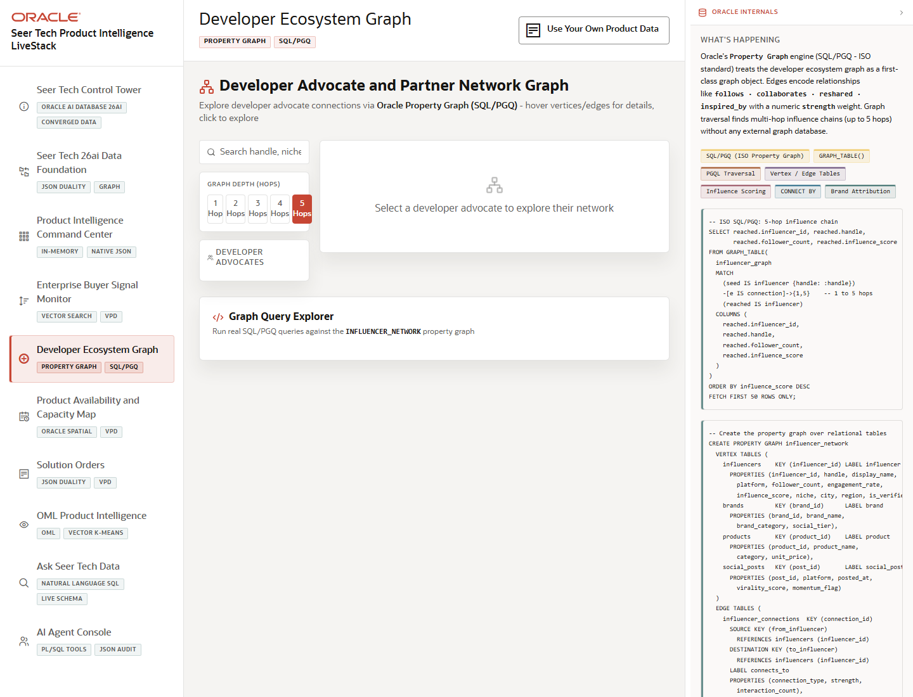

# Scene 5 Developer Ecosystem Graph

## Introduction

The graph scene visualizes developer advocates, influencer connections, brand links, and product mentions so the operator can understand how market signals propagate through the developer ecosystem.

Estimated Time: 8 minutes

### Objectives

In this lab, you will:
- Explore the developer ecosystem graph from a selected advocate.
- Change traversal depth and inspect centrality-style metrics.
- Run example SQL/PGQ queries and review the generated evidence.

## Task 1: Select a Developer Advocate

1. Open **Developer Ecosystem Graph** from the left navigation.
2. Search for a developer advocate or select one from the list.
3. Adjust traversal depth between available hop levels and inspect the network visualization.

Expected result:
- The graph updates around the selected advocate and shows connected nodes and relationships.
- Metric cards summarize followers, influence score, engagement, connections, node count, edge count, and depth.

## Task 2: Run an Example Graph Query

1. Open the example query selector.
2. Choose a query that explores propagation, brand attribution, or influence paths.
3. Click **Run Query**, then inspect the result and optional SQL display.

Expected result:
- The page returns graph evidence that can explain why a product signal is spreading.
- The presenter can connect SQL/PGQ or GRAPH_TABLE behavior to a visible business decision.

## Task 3: Why this matters?

Product demand often spreads through people and relationships, not just transactions. This scene shows how graph analysis helps Seer Tech identify which advocates and communities are amplifying product opportunities or risks.

## Credits & Build Notes
- **Author** - Oracle LiveStack Team
- **Last Updated By/Date** - Oracle LiveStack Team, 2026-05-13
- **Source Bundle** - `livestack-hightech.zip`
