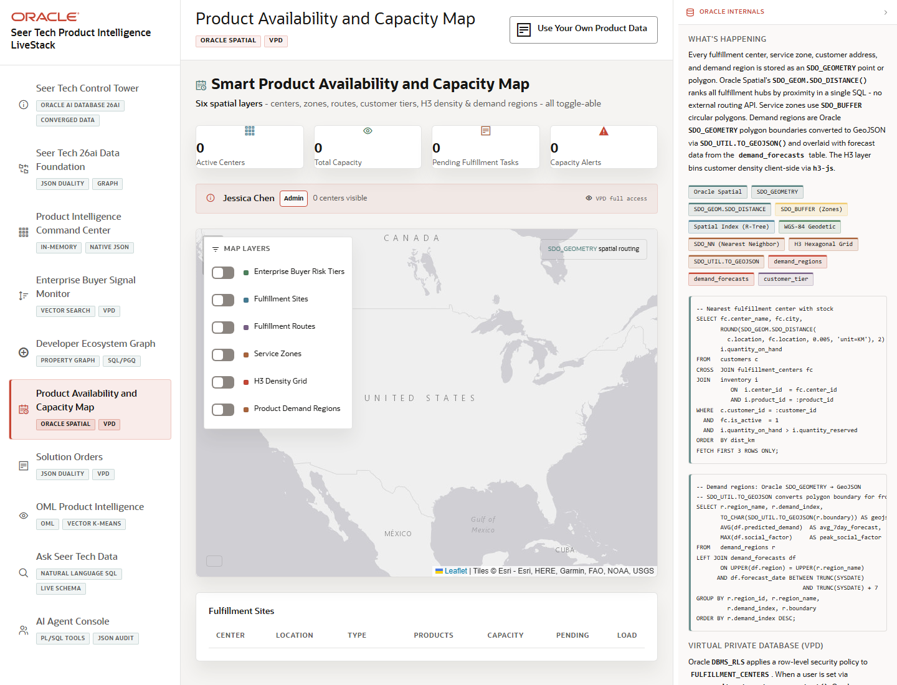

# Scene 6 Product Availability and Capacity Map

## Introduction

This scene demonstrates spatial product availability with fulfillment sites, routes, service zones, demand overlays, buyer risk tiers, and VPD-aware access.

Estimated Time: 8 minutes

### Objectives

In this lab, you will:
- Review spatial layers and capacity alerts on the availability map.
- Toggle layers to compare fulfillment sites, routes, zones, H3 density, and demand regions.
- Connect spatial routing and row-level security to operational decisions.

## Task 1: Inspect the Spatial Map

1. Open **Product Availability and Capacity Map** from the left navigation.
2. Review the map and KPI cards for pending fulfillment tasks, capacity alerts, and demand regions.
3. Use the layer controls to select Fulfillment Sites, Fulfillment Routes, Service Zones, H3 Density Grid, Enterprise Buyer Risk Tiers, and Product Demand Regions.

Expected result:
- Each layer changes what the operator can see on the map.
- The page demonstrates Oracle Spatial concepts such as SDO_GEOMETRY, SDO_BUFFER, spatial indexes, nearest-neighbor routing, and GeoJSON rendering.

## Task 2: Compare Capacity Risk

1. Review the fulfillment sites table and capacity alert list.
2. Select a demo user from the sidebar to show how VPD-aware context can change visible records when the database is connected.
3. Compare a high-demand region with nearby fulfillment site capacity.

Expected result:
- The operator can identify where product availability, location, and buyer tier combine into a fulfillment decision.
- The presenter can explain how spatial SQL and VPD policies support a governed operational map.

## Task 3: Why this matters?

Availability risk is geographic. This scene shows how Seer Tech can route product decisions through spatial data, capacity signals, and security policies without leaving Oracle Database-backed workflows.

## Credits & Build Notes
- **Author** - Oracle LiveStack Team
- **Last Updated By/Date** - Oracle LiveStack Team, 2026-05-13
- **Source Bundle** - `livestack-hightech.zip`
