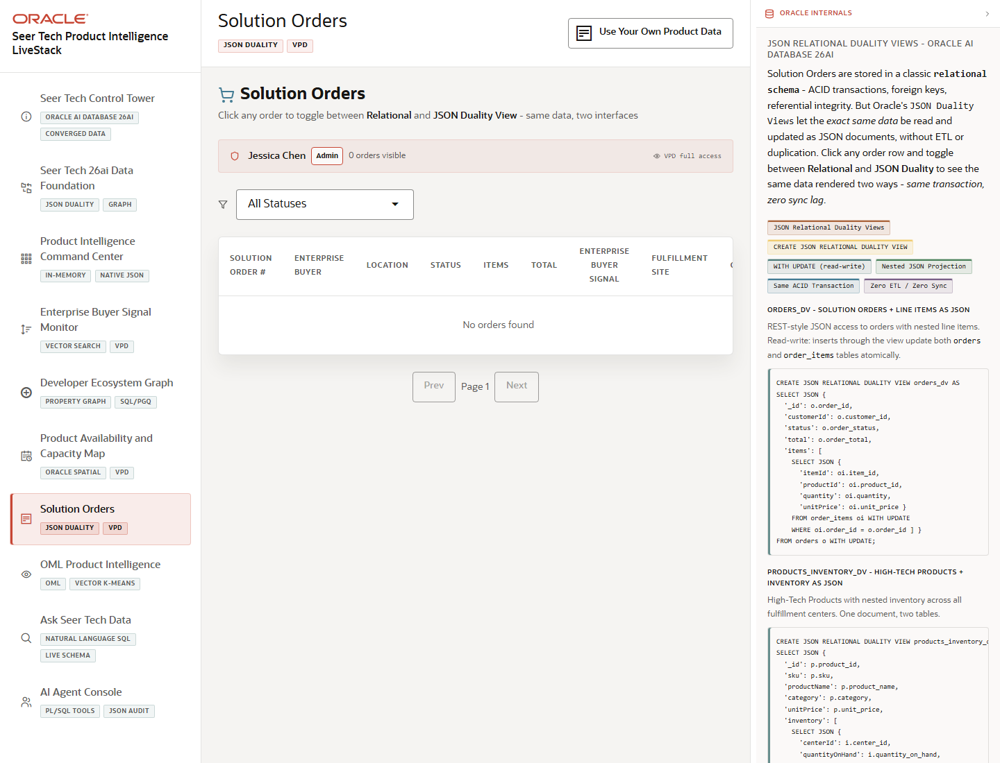

# Scene 7 Solution Orders

## Introduction

The orders scene shows solution orders as operational rows, JSON relational duality documents, and fulfillment route evidence, all filtered through governed application access.

Estimated Time: 8 minutes

### Objectives

In this lab, you will:
- Review solution orders and status filters.
- Open order details and switch between relational, JSON duality, and route views.
- Demonstrate how VPD and JSON duality can serve different consumers from the same transaction.

## Task 1: Filter and Open Orders

1. Open **Solution Orders** from the left navigation.
2. Use the status filter to narrow orders to Pending, Confirmed, Processing, Shipped, Delivered, or Cancelled.
3. Click an order to open the detail view.

Expected result:
- The order list narrows based on the selected status.
- The detail panel opens with the selected buyer, product, value, shipping, and fulfillment context.

## Task 2: Compare Relational, JSON, and Route Views

1. In the detail panel, select **Relational** to review operational attributes.
2. Select **JSON Duality View** to inspect the nested JSON projection.
3. Select **Fulfillment Route** to review route distance, delivery window, cost, and status.

Expected result:
- The same order can be explained as relational data, a JSON document, and a spatial route.
- The presenter can show how JSON relational duality serves application and API consumers without duplicating the transaction.

## Task 3: Why this matters?

Orders are where the product-intelligence story becomes operational. This scene shows how Oracle can expose the same governed transaction through relational, JSON, security, and routing views.

## Credits & Build Notes
- **Author** - Oracle LiveStack Team
- **Last Updated By/Date** - Oracle LiveStack Team, 2026-05-13
- **Source Bundle** - `livestack-hightech.zip`
