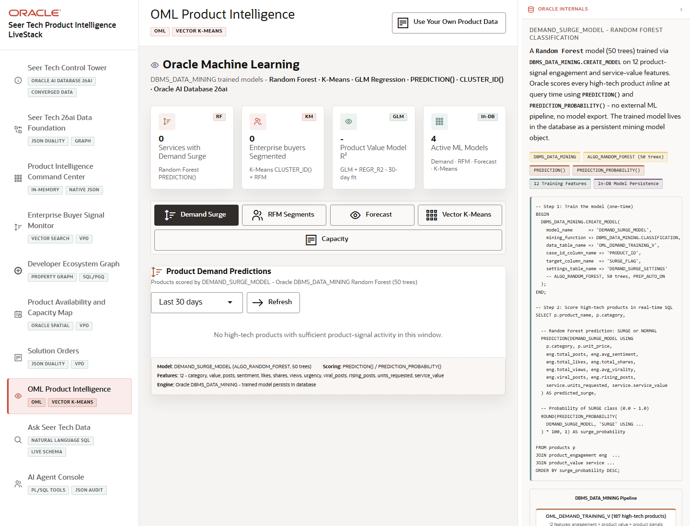

# Scene 8 OML Product Intelligence

## Introduction

The OML scene demonstrates in-database machine learning for demand surge prediction, enterprise buyer segmentation, value forecasting, vector clustering, and capacity intelligence.

Estimated Time: 8 minutes

### Objectives

In this lab, you will:
- Review the ML summary cards and active model tabs.
- Refresh demand scoring, forecast fitting, vector clustering, and capacity scoring.
- Explain how in-database ML reduces data movement for product operations.

## Task 1: Walk Through the OML Tabs

1. Open **OML Product Intelligence** from the left navigation.
2. Review the summary cards for products with surge, enterprise buyers, model fit, and active models.
3. Select each tab: **Demand Surge**, **RFM Segments**, **Forecast**, **Vector K-Means**, and **Capacity**.

Expected result:
- Each tab presents a different in-database ML lens on product operations.
- The page links visible metrics to DBMS_DATA_MINING, prediction functions, clustering, regression, and vector features.

## Task 2: Run Refresh Actions

1. Click **Refresh** or the relevant action button in the Demand Surge, Forecast, Vector K-Means, or Capacity tabs when the database is connected.
2. Change the lookback or forecast horizon where controls are available.
3. Compare predicted surge, segmentation, forecast quality, cluster assignments, and product value at risk.

Expected result:
- The selected panel refreshes its scores or model output from Oracle-backed APIs.
- The presenter can explain how ML scores feed product availability, demand, and capacity decisions.

## Task 3: Why this matters?

The value of product intelligence rises when models run where governed data already lives. This scene shows Seer Tech using Oracle Machine Learning to score demand and capacity without exporting sensitive operational data.

## Credits & Build Notes
- **Author** - Oracle LiveStack Team
- **Last Updated By/Date** - Oracle LiveStack Team, 2026-05-13
- **Source Bundle** - `livestack-hightech.zip`
