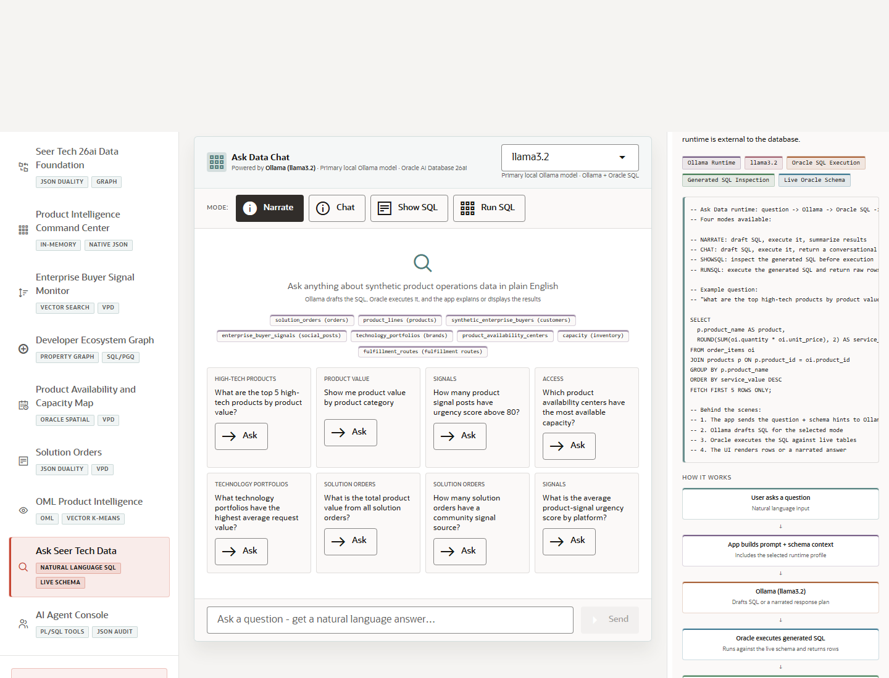

# Scene 9 Ask Seer Tech Data

## Introduction

Ask Seer Tech Data gives users a natural-language interface over the live schema, with modes for narration, chat, SQL inspection, and SQL execution.

Estimated Time: 8 minutes

### Objectives

In this lab, you will:
- Ask a product operations question in plain English.
- Switch between Narrate, Chat, Show SQL, and Run SQL modes.
- Review how generated responses stay grounded in Oracle SQL execution.

## Task 1: Ask a Guided Question

1. Open **Ask Seer Tech Data** from the left navigation.
2. Choose a runtime profile if multiple profiles are available.
3. Click an example question such as **What are the top 5 high-tech products by product value?** or type your own question.

Expected result:
- The question appears in the chat surface and the app sends it to the selected Select AI or Ollama-backed route.
- When services are connected, the answer includes generated SQL context, rows, or a narrated response depending on the selected mode.

## Task 2: Compare Answer Modes

1. Select **Narrate** for an executive-style answer.
2. Select **Show SQL** to inspect generated SQL without running it.
3. Select **Run SQL** to execute the generated SQL and review returned rows.

Expected result:
- The mode changes the output format while preserving the same product-intelligence question.
- The presenter can show how natural language becomes governed SQL-backed evidence.

## Task 3: Why this matters?

Natural-language access helps more stakeholders use product intelligence safely. This scene shows how the app can expose Oracle-backed answers while still making generated SQL inspectable.

## Credits & Build Notes
- **Author** - Oracle LiveStack Team
- **Last Updated By/Date** - Oracle LiveStack Team, 2026-05-13
- **Source Bundle** - `livestack-hightech.zip`
