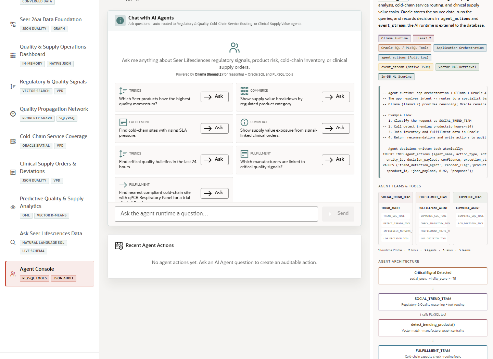

# Scene 10 Agent Console

## Introduction

The Agent Console shows AI-assisted operational teams for regulatory and quality signals, cold-chain service routing, and clinical supply value. It combines an Ollama runtime with Oracle SQL and PL/SQL tools and writes actions into audit tables.

Estimated Time: 10 minutes



### Objectives

In this lab, you will:
- Ask an agent runtime question.
- Use example prompts to route the question to the right specialist team.
- Review actions, events, tool history, and audit evidence.

## Task 1: Ask an agent question

1. Select **Agent Console**.
2. Choose a runtime profile if more than one is available.
3. Click an example prompt or enter a question such as `Which critical products have low inventory and need allocation review?`.
4. Click **Send**.

Expected result:
- The agent runtime responds with an operational recommendation or analysis.
- The recommendation is connected to Oracle SQL or PL/SQL tool execution rather than a detached chat response.

## Task 2: Review audit evidence

1. Inspect the action, event, team history, or tool history panels after an agent cycle or question has run.
2. Compare the recommendation to the related inventory, routing, quality signal, or order data shown elsewhere in the app.
3. Use the Oracle information panel to explain the agent teams and audit tables.

Expected result:
- The audience sees how AI recommendations can be traced through actions and events.
- The scene demonstrates an agent workflow that can be explained, reviewed, and governed.

## Task 3: Why this matters?

AI agents in regulated settings need traceability. This scene shows how an assistant-style workflow can still leave evidence through Oracle-backed tools, JSON events, and audit records.

## Credits & Build Notes
- **Author** - LiveLabs Team
- **Last Updated By/Date** - LiveLabs Team, 2026-05-13
- **Source LiveStack** - livestack-lifesciences.zip
