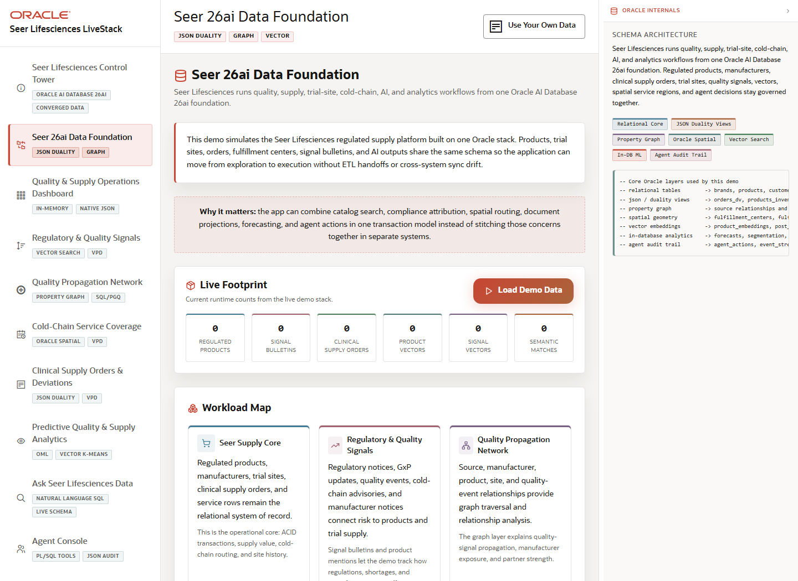

# Scene 2 Seer 26ai Data Foundation

## Introduction

The data foundation scene shows how regulated product, manufacturer, trial site, order, quality signal, graph, spatial, vector, ML, and agent audit data are loaded and organized in Oracle AI Database 26ai.

Estimated Time: 10 minutes



### Objectives

In this lab, you will:
- Inspect the data products and converged database capabilities behind the demo.
- Use the demo data control to verify or refresh the seed dataset.
- Connect each visible data domain to the downstream operator workflows.

## Task 1: Review the foundation status

1. Select **Seer 26ai Data Foundation** in the sidebar.
2. Review the status cards for products, trial sites, orders, signal bulletins, semantic matches, and graph edges.
3. Open the Oracle information panel if it is available and use it to explain the relational, JSON, graph, spatial, vector, ML, and agent audit surfaces.

Expected result:
- The audience understands that multiple application experiences are using one Oracle database foundation.
- The presenter can point to the specific tables, views, and features that back the rest of the demo.

## Task 2: Verify or refresh demo data

1. Click **Verify & Refresh Demo** when the full backend stack is running.
2. Watch the progress events as products, trial sites, orders, signal posts, embeddings, graph data, and fulfillment zones are checked or refreshed.
3. If the backend is unavailable, explain that the page will show the app shell while data status calls wait for the API.

Expected result:
- With the full stack running, the seed data refresh completes and the status cards reflect loaded data.
- The operator has confidence that the downstream scenes are using the intended demo dataset.

## Task 3: Why this matters?

This matters because regulated operations teams need a trustworthy data product foundation before they can automate quality, allocation, routing, and compliance decisions. The scene makes the Oracle Database 26ai foundation visible before the presenter moves into higher-level workflows.

## Credits & Build Notes
- **Author** - LiveLabs Team
- **Last Updated By/Date** - LiveLabs Team, 2026-05-13
- **Source LiveStack** - livestack-lifesciences.zip
