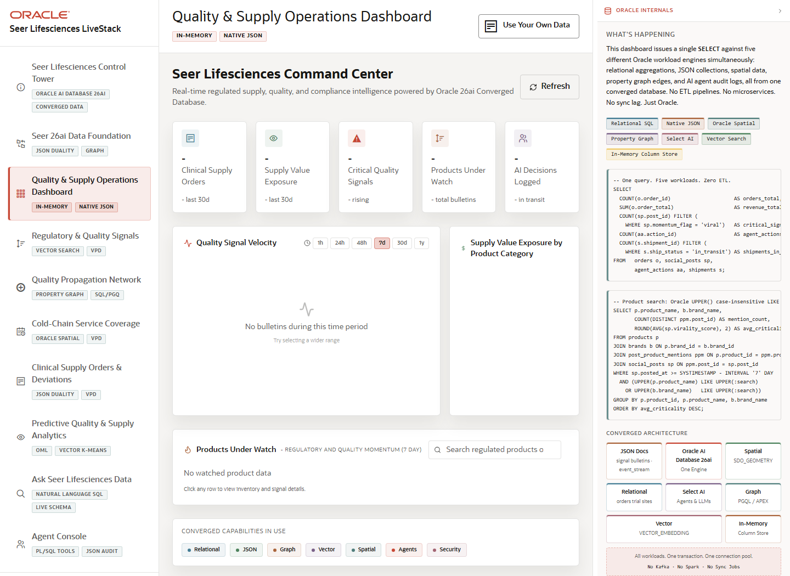

# Scene 3 Quality and Supply Operations Dashboard

## Introduction

The operations dashboard is the first business operations scene. It summarizes active supply, quality, and demand signals and lets the presenter drill into product detail, inventory, signal mentions, and JSON duality views.

Estimated Time: 10 minutes



### Objectives

In this lab, you will:
- Review operational metrics and trending regulated products.
- Search and select a product to inspect supply and quality evidence.
- Show how the same product data can be viewed through relational details and JSON duality.

## Task 1: Inspect the operational summary

1. Select **Quality & Supply Operations Dashboard**.
2. Review the top metric cards, velocity chart, category mix, and demand map panels.
3. Use the search box or trending product table to focus the discussion on a regulated product or product family.

Expected result:
- The dashboard gives a fast view of supply pressure, quality signals, and commercial or clinical demand.
- The presenter can identify the products or categories that need follow-up in later scenes.

## Task 2: Open product evidence

1. Select a product row from the trending table.
2. Review the product detail modal, including inventory by cold-chain site and recent quality or compliance signal mentions.
3. Switch to **JSON Duality View** to show the same data exposed as a nested JSON document.

Expected result:
- The audience sees an operator path from summary signal to product-level evidence.
- The JSON duality tab demonstrates how application developers can work with document-shaped data while Oracle preserves relational integrity.

## Task 3: Why this matters?

This dashboard turns database-backed signals into an operator starting point. It shows which products deserve attention and creates the bridge to vector search, graph propagation, spatial coverage, and AI agent scenes.

## Credits & Build Notes
- **Author** - LiveLabs Team
- **Last Updated By/Date** - LiveLabs Team, 2026-05-13
- **Source LiveStack** - livestack-lifesciences.zip
