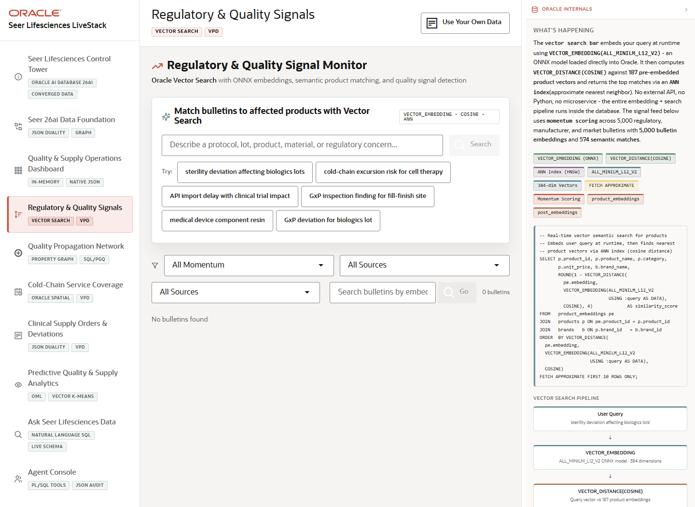

# Scene 4 Regulatory and Quality Signals

## Introduction

The quality signals scene uses vector search over embedded bulletins and product descriptions to match regulatory, quality, protocol, lot, and supply concerns to affected life sciences products.

Estimated Time: 10 minutes



### Objectives

In this lab, you will:
- Run semantic searches over quality and regulatory signal text.
- Filter and inspect bulletin streams by momentum, source, and source channel.
- Explain how in-database embeddings and vector distance support governed retrieval.

## Task 1: Run a vector search

1. Select **Regulatory & Quality Signals**.
2. In the vector search panel, enter a query such as `sterility deviation affecting biologics lots`.
3. Click **Search** or choose one of the example queries.
4. Review the ranked products, similarity scores, and matching evidence returned by the app.

Expected result:
- The app returns products and bulletins that are semantically related to the quality concern rather than only exact keyword matches.
- The presenter can explain that embedding generation and vector distance run against governed Oracle data.

## Task 2: Filter the bulletin stream

1. Use the momentum and source filters to narrow the bulletin stream.
2. Search the bulletin list for a concern, material, lot, product, or protocol term.
3. Compare the filtered results to the ranked vector results above the stream.

Expected result:
- The operator can move from broad signal detection to a focused list of quality or regulatory evidence.
- The scene shows how search, filters, and governed row access can coexist in one UI.

## Task 3: Why this matters?

Life sciences teams often need to connect ambiguous language in quality reports, regulatory notes, and market signals to concrete product and supply actions. This scene makes that retrieval path operational and auditable.

## Credits & Build Notes
- **Author** - LiveLabs Team
- **Last Updated By/Date** - LiveLabs Team, 2026-05-13
- **Source LiveStack** - livestack-lifesciences.zip
